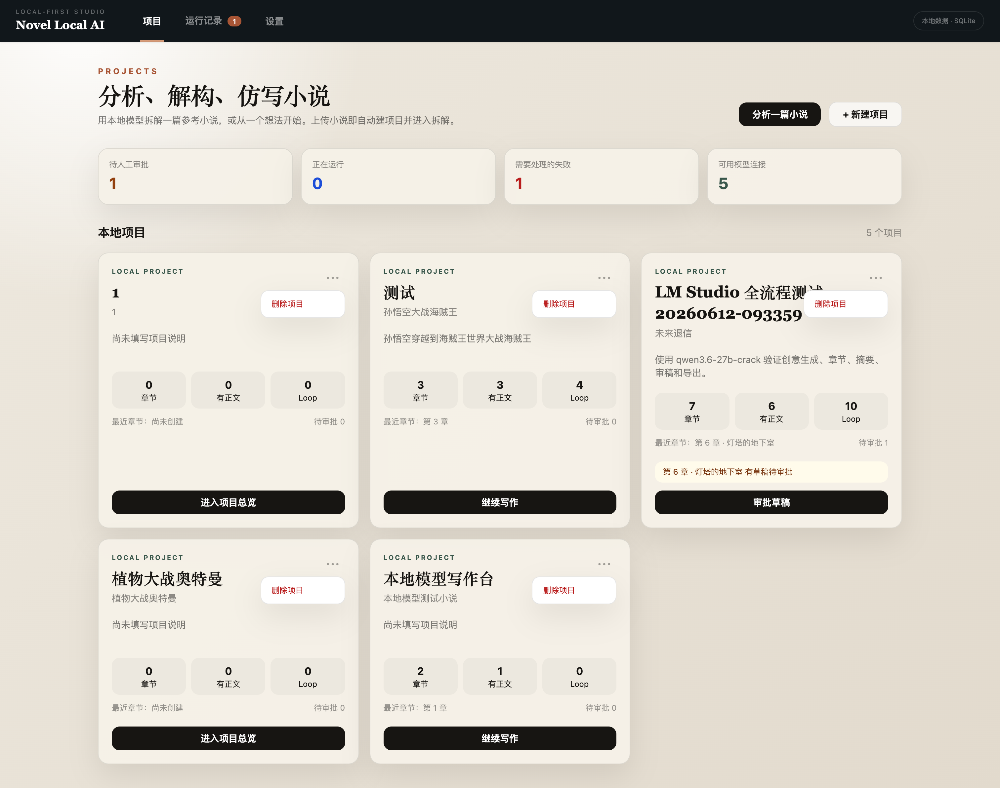
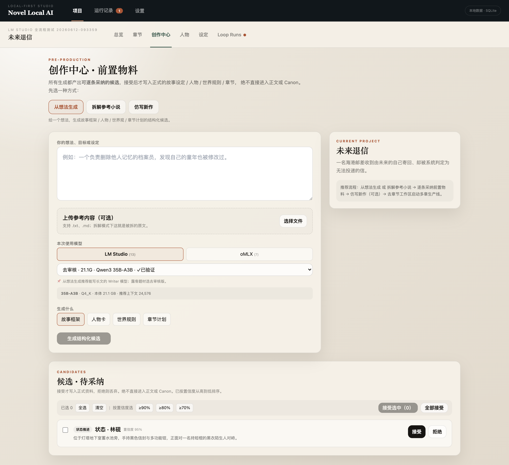
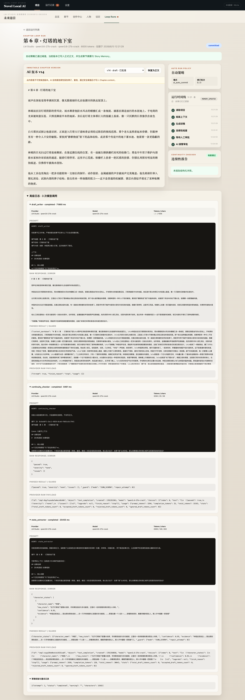

# Novel Local AI

> Local-first AI novel writing studio for macOS and local LLMs.

[](LICENSE)
[](services/api/pyproject.toml)
[](apps/web/package.json)
[](CHANGELOG.md)

Novel Local AI 是面向 macOS 的本地优先 AI 小说写作工作台。它把故事资料、章节计划、正文生成、连续性检查、自动修订、人工审批和长期记忆放进一套可追踪流程，并优先连接 LM Studio、llama.cpp、Ollama 等本机模型服务。

当前 `v1.0.0` 是可运行的开源 MVP 3 基线，不是商业发布完成品。模型权重、用户数据库、运行日志和 API Key 不包含在仓库中。

## 界面预览

### 项目工作台



### 从想法生成故事资料



### 版本、连续性报告与审批



更多页面截图位于 [`docs/design_shots/`](docs/design_shots/)。

## 核心能力

- 项目、小说、章节、人物、世界规则和 Prompt 管理。
- 从一个想法生成可审核的故事框架、角色、世界观和章节计划候选。
- 统一接入 LM Studio、llama.cpp、Ollama、KoboldCpp、text-generation-webui 和 OpenAI-compatible API。
- 按预算组装章节目标、人物状态、世界规则、近期摘要、伏笔和指定引用。
- 单章 Loop：草稿、连续性检查、AI 修订、人工审批或自动提交。
- 多章生产线：任意正整数章数，遇到 blocker、模型异常或上下文不足时暂停。
- 不可变 `ChapterVersion`、`RunStep`、`ModelCall`、`GenerationRun` 和检查报告。
- 提交后生成章节摘要和最小 Story Memory，支持历史版本恢复。
- Reference Pack：引用章节/版本而不把整本全文塞进上下文。
- 正向故事工程、已有小说结构化拆解与 staging/证据接受机制。
- Markdown 导出。

## 架构

```text
React 18 + TypeScript + Vite + Tailwind
                    |
                 REST API
                    |
FastAPI + Pydantic + SQLAlchemy + Alembic
                    |
                  SQLite
                    |
        Model Provider Adapter Layer
                    |
 LM Studio / llama.cpp / Ollama / KoboldCpp
```

所有模型调用都经过统一 Provider adapter。AI 初稿和修订先保存为不可变版本；手动模式只有 approve 才更新正式正文，自动模式遇到 blocker 或校验失败必须暂停。

## 快速启动

要求：macOS、Python 3.9+、Node.js 18+。没有模型服务时，CRUD、手工编辑和 Markdown 导出仍可使用。

### 1. 后端

```bash
git clone https://github.com/ccBilly-aipm/novel-local-ai-open-source.git
cd novel-local-ai-open-source/services/api
python3 -m venv .venv
source .venv/bin/activate
python -m pip install -e ".[dev]"
alembic upgrade head
uvicorn app.main:app --reload --host 127.0.0.1 --port 8000
```

API 文档：<http://127.0.0.1:8000/docs>

### 2. 前端

另开终端：

```bash
cd novel-local-ai-open-source/apps/web
npm install
npm run dev
```

浏览器打开：<http://127.0.0.1:5173/>

依赖安装完成后，也可以在仓库根目录执行 `./scripts/dev.sh` 同时启动前后端。

## 配置本地模型

| 服务 | 常用 Base URL | 使用前检查 |
|---|---|---|
| LM Studio | `http://127.0.0.1:1234/v1` | 加载模型并开启 Local Server |
| llama.cpp | `http://127.0.0.1:8080/v1` | 以实际 `llama-server` 端口为准 |
| Ollama | `http://127.0.0.1:11434` | 使用 `ollama list` 中的模型名 |
| KoboldCpp | 实际服务地址 | 确认当前版本 API 路径 |
| text-generation-webui | 通常以 `/v1` 结尾 | 开启 OpenAI-compatible 扩展 |

发现本地模型文件不代表模型服务正在运行。请先在“本地模型”页面测试 Provider，再启动长章节任务。

## 推荐流程

1. 配置并测试本地模型。
2. 创建项目，输入故事总纲或在“创作中心”生成结构候选。
3. 人工接受可信的角色、世界规则和章节计划候选。
4. 确认章节目标、大纲、运行模式和引用内容。
5. 启动单章 Loop 或多章生产线。
6. 查看版本链、连续性报告、自动修订和模型日志。
7. 人工 approve，或让 Auto Commit 在达到阈值后写入正式正文。
8. 导出 Markdown。

详细操作见 [用户手册](docs/USER_GUIDE.md)。

## 测试

```bash
cd services/api
.venv/bin/pytest

cd ../../apps/web
npm run build
```

`v1.0.0` 开源基线发布前验证为：后端 `70 passed`，前端生产构建通过。当前尚无浏览器 E2E 测试。

## 数据与隐私

- SQLite、WAL/SHM、`.env`、日志、缓存、模型文件和部署备份均被 `.gitignore` 排除。
- API Key 当前保存在本地 SQLite，尚未接入 macOS Keychain；不要上传带密钥的数据库或日志。
- 本地开发仓库与 LaunchAgent 部署副本可能是两个目录，修改后请明确同步目标。
- 模型生成内容可能不准确；自动提交模式仍应保留版本、日志和人工回滚路径。
- 安全问题请按 [SECURITY.md](SECURITY.md) 私下报告，不要在公开 Issue 中提交密钥或小说正文。

## 文档

- [用户手册](docs/USER_GUIDE.md)
- [Agent 开发手册](AGENTS.md)
- [项目交接文档](PROJECT_HANDOFF.md)
- [当前能力索引](docs/AI_CURRENT_STATUS.md)
- [运行与测试](docs/AI_RUN_AND_TEST_GUIDE.md)
- [架构图](docs/AI_ARCHITECTURE_MAP.md)
- [贡献指南](CONTRIBUTING.md)
- [变更记录](CHANGELOG.md)

## Roadmap

- 浏览器 E2E 与版本 Diff UI。
- 持久化 Writer/Checker/Summary/Extractor 模型角色。
- 更完整的 CharacterState、Timeline、Foreshadowing 和 Relationship Story Memory。
- SSE/WebSocket 状态推送。
- macOS Keychain 与 Tauri 桌面打包。
- 在 MVP 稳定后再评估轻量 RAG/GraphRAG。

## 开源许可

本项目采用 [Apache License 2.0](LICENSE)。提交代码即表示你有权提交该内容，并同意其按 Apache-2.0 发布。第三方依赖和模型各自遵循其许可证；本仓库不授予任何模型权重的再分发权。

## English summary

Novel Local AI is a local-first AI novel writing studio for macOS. It combines project and story-bible management, chapter generation, continuity checking, immutable versions, human approval, auto-revision, auto-commit, multi-chapter runs, references, and minimal story memory. See the Chinese sections above for setup and architecture details.
