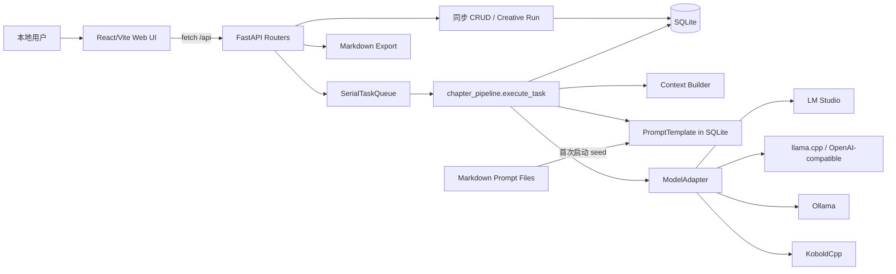
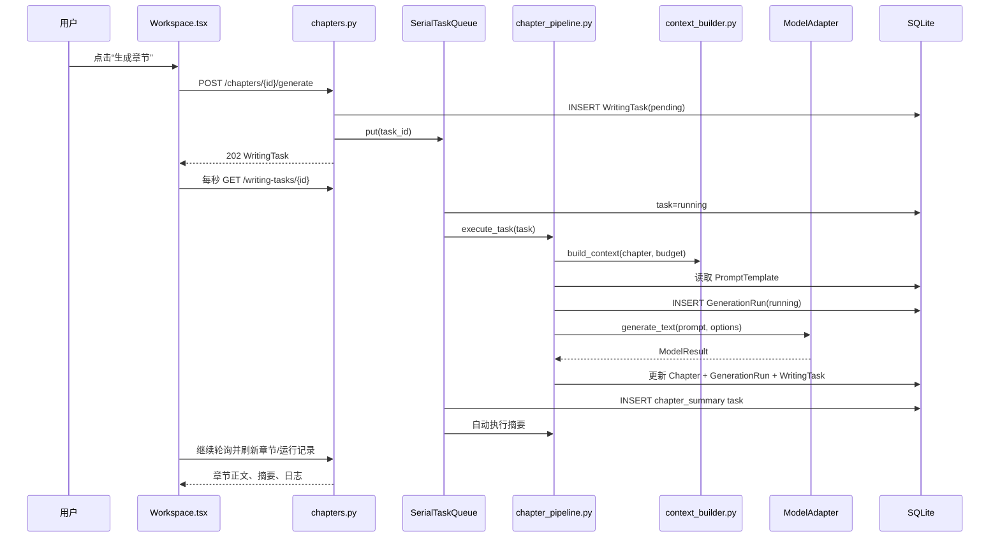
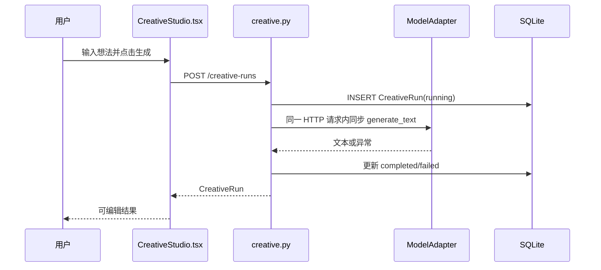
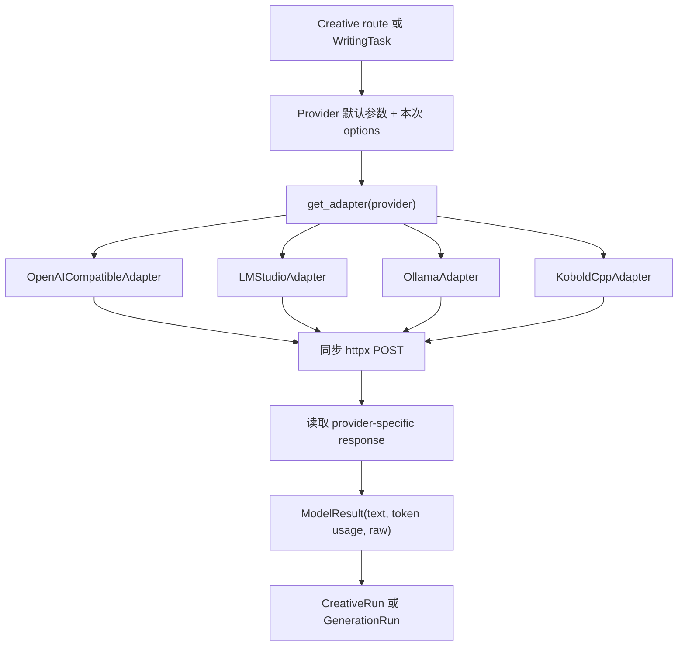

# 现有项目结构审计报告

审计日期：2026-06-12

审计对象：`novel-local-ai` 当前工作区代码、现有测试、现有文档，以及本机正在运行的服务进程。

## 项目一句话总结

这是一个本地优先的 AI 小说写作 MVP：React 页面通过 FastAPI 管理小说结构化数据，章节类模型任务进入单 worker 串行队列，再由统一 Provider Adapter 调用本地模型，并把 Prompt、输出、耗时和错误写入 SQLite。

它当前不是多 Agent 系统。代码中不存在独立 Agent 抽象、循环状态机、自动修订闭环或 Reflection Agent；现状更准确地说是“CRUD + Prompt 模板 + 单步章节流水线”。

## 1. 技术栈判断

| 范围 | 当前实现 | 代码证据 | 审计结论 |
|---|---|---|---|
| 前端 | React 18、TypeScript、Vite、Tailwind CSS | `apps/web/package.json`、`apps/web/vite.config.ts`、`apps/web/tailwind.config.js` | 单页应用，无 React Router、状态管理库或组件库 |
| 后端 | Python、FastAPI、Pydantic 2 | `services/api/pyproject.toml`、`services/api/app/main.py` | 同步路由为主 |
| ORM | SQLAlchemy 2 | `services/api/app/db.py`、`services/api/app/models/entities.py` | 未使用 SQLModel |
| 数据库 | SQLite | `services/api/app/db.py` | 默认位于 `data/novel_local_ai.db`，可由 `NOVEL_AI_DB_URL` 覆盖 |
| Schema | Pydantic | `services/api/app/schemas/entities.py` | API schema 较完整，但多个 JSON 字段仍以字符串返回 |
| HTTP Client | httpx | `services/api/app/providers/adapters.py` | 所有模型请求为非流式同步 HTTP |
| 本地任务队列 | `queue.Queue` + daemon thread | `services/api/app/services/task_queue.py` | 单进程、单 worker、串行；不是 Celery/Redis/Temporal |
| 后台任务 | 一个常驻线程 | `SerialTaskQueue._worker()` | 支持 pending 恢复、失败重试和协作式暂停 |
| 定时任务 | 不存在 | 全仓库未发现 scheduler/cron 代码 | 未在代码中发现证据 |
| 模型抽象 | 自定义 `ModelAdapter.generate_text()` | `services/api/app/providers/base.py`、`providers/adapters.py` | 支持 OpenAI-compatible、LM Studio、Ollama、KoboldCpp |
| Prompt 存储 | Markdown 文件首次 seed 到 SQLite | `services/api/app/prompts/`、`services/api/app/services/prompt_store.py` | 运行时以数据库记录为准 |
| 导出 | Markdown | `services/api/app/routers/export.py` | 不包含 EPUB/PDF |
| 测试 | pytest + FastAPI TestClient | `services/api/tests/test_api.py` | 后端集成测试 5 项；无前端自动化测试 |
| 环境变量 | `NOVEL_AI_DB_URL` | `services/api/app/db.py` | 未发现 `.env` 文件或配置加载库 |
| 启动脚本 | Bash | `scripts/dev.sh` | 同时启动 uvicorn 和 Vite |

### 当前实机运行状态

审计时观察到以下服务：

| 地址 | 进程 | 用途 |
|---|---|---|
| `127.0.0.1:5173` | Vite preview | 已构建前端 |
| `127.0.0.1:8000` | uvicorn | FastAPI |
| `127.0.0.1:1234` | LM Studio | 当前本地模型 API；加载 `qwen3.6-27b-crack`，16384 context，审计时为 idle |
| `127.0.0.1:18081` | llama-server | 小模型联调服务 |

当前部署副本运行于 `~/Library/Application Support/NovelLocalAI/`。仓库内标准开发入口仍是 `scripts/dev.sh`。

## 2. 目录结构说明

```text
novel-local-ai/
├── apps/
│   └── web/                         # React/Vite 前端
│       ├── src/components/          # 页面级组件
│       ├── src/services/api.ts      # 统一 fetch 封装
│       ├── src/types.ts             # 前端实体类型
│       └── vite.config.ts           # /api 反向代理
├── services/
│   └── api/                         # FastAPI 后端
│       ├── app/main.py              # 应用入口、lifespan、路由注册
│       ├── app/db.py                # SQLite/SQLAlchemy
│       ├── app/models/              # ORM 实体
│       ├── app/schemas/             # Pydantic API schema
│       ├── app/routers/             # REST 路由
│       ├── app/services/            # 上下文、任务队列、Prompt 存储、模型扫描
│       ├── app/providers/           # 模型 Adapter
│       ├── app/pipelines/           # 章节单步流水线
│       ├── app/prompts/             # 6 个 Markdown Prompt
│       └── tests/                   # 后端集成测试
├── data/
│   ├── novel_local_ai.db            # 默认 SQLite（运行后产生）
│   └── sample_project/              # 示例占位
├── docs/                            # 架构、API、调研、Prompt 等文档
├── scripts/dev.sh                   # 开发启动脚本
└── README.md
```

### 分层对应

| 关注点 | 当前目录 | 状态 |
|---|---|---|
| UI | `apps/web/src/components/` | 存在 |
| API | `services/api/app/routers/` | 存在 |
| Storage | `db.py`、`models/` | 存在 |
| Prompt | `app/prompts/`、`prompt_store.py` | 存在 |
| Model Client | `providers/` | 存在 |
| Workflow | `pipelines/chapter_pipeline.py`、`services/task_queue.py` | 仅单步流程 |
| Agent | 无独立目录或抽象 | 不存在 |
| Run Log | `WritingTask`、`GenerationRun`、`CreativeRun` | 部分存在 |
| Utils | `services/common.py` | 很薄，仅 JSON 和 404 helper |

## 3. 启动流程

### 开发启动

1. 后端安装和启动见 `README.md`：
   `uvicorn app.main:app --reload --host 127.0.0.1 --port 8000`。
2. 前端安装和启动见 `README.md`：
   `npm run dev`，监听 `127.0.0.1:5173`。
3. `scripts/dev.sh` 会同时启动二者，并在脚本退出时 kill 子进程。

### 后端启动时发生什么

`services/api/app/main.py` 的 lifespan 顺序：

1. `create_tables()` 使用 `Base.metadata.create_all()` 创建缺失表。
2. `seed_prompt_templates()` 把尚不存在的 Markdown Prompt 插入 `prompt_templates`。
3. `task_queue.start()` 启动 daemon worker。
4. `recover_pending()` 将重启前的 `running` 任务标记失败，并重新入队 `pending` 任务。

没有 Alembic；`create_all()` 不负责已有表的字段迁移。

### 浏览器请求如何进入后端

1. React 调用 `apps/web/src/services/api.ts`。
2. 所有路径自动加 `/api`。
3. Vite 开发代理把 `/api` 转发到 `127.0.0.1:8000`。
4. `app.main` 注册对应 APIRouter。
5. 路由通过 `get_db()` 获得独立 SQLAlchemy Session。

## 4. 总体架构图



## 5. 请求链路图

### 章节生成



### 创意生成



创意生成不进入 `WritingTask`，因此没有暂停、后台恢复或任务轮询。

## 6. 数据流说明

### 项目与内容输入

| 用户输入 | 前端入口 | API | 数据落点 |
|---|---|---|---|
| 项目、小说标题、简介 | `Dashboard.tsx` | `POST /projects`、`POST /novels` | `projects`、`novels` |
| 想法、上传文本 | `CreativeStudio.tsx` | `POST /creative-runs` | `creative_runs` |
| 总纲、风格、禁止事项 | `Workspace.tsx` | `PATCH /novels/{id}` | `novels` |
| 章节标题、目标、大纲、正文 | `Workspace.tsx` | `POST/PATCH /chapters` | `chapters`、`chapter_outlines` |
| 角色卡 | `CharacterCards.tsx` | `/characters` | `characters` |
| 世界规则 | `Worldbuilding.tsx` | `/world-rules` | `world_rules` |
| Prompt 修改 | `PromptManager.tsx` | `PATCH /prompt-templates/{id}` | `prompt_templates` |
| Provider 参数 | `ModelSettings.tsx` | `/model-providers` | `model_providers` |

### 章节模型结果

- 正文：覆盖 `Chapter.content`，版本号加一。
- 摘要：写入 `Chapter.summary`，并同步到 `CanonState.chapter_summaries_json`。
- 关键事件：追加到 `CanonState.key_events_json`。
- 冲突和伏笔：当前摘要结果会整体替换 Canon 中对应列表。
- 人物状态：先写入 `pending_character_updates_json`，由前端人工合并。
- 审稿：新增 `ReviewResult`，不自动修改正文。
- 原始 Prompt/Response：写入 `GenerationRun`。

## 7. 模型调用链说明



### 调用入口

1. `creative.generate_creative()`：同步创意生成。
2. `chapter_pipeline.execute_task()`：章节生成、摘要、审稿、人物状态。
3. `model_providers.test_provider()`：健康检查。

### Prompt 来源

- 章节类：`services/api/app/prompts/*.md` 首次 seed 到 SQLite，运行时从数据库读取。
- 创意类：`services/api/app/routers/creative.py` 中 `OPERATION_GUIDES` 和 `build_prompt()` 动态拼接。
- Provider 测试：`model_providers.py` 中写死“只回复 OK”。
- LM Studio no-think：`providers/adapters.py` 额外加入 ChatML system wrapper。

### 参数配置

- Provider 默认参数：`ModelProvider.default_options_json`。
- 页面预设：`ModelSettings.tsx`。
- 创意任务覆盖：`CreativeStudio.tsx`。
- 章节任务覆盖：`Workspace.tsx`。
- Adapter 默认：`providers/adapters.py`。
- 超时：`ModelProvider.timeout_seconds`。
- Streaming：全部显式或事实为非流式；没有 SSE/WebSocket。

### Retry、timeout、fallback

- HTTP timeout：存在，由 Provider 配置。
- 自动模型调用 retry：不存在。
- Provider fallback：不存在。
- 手工任务 retry：存在，复用同一个 `WritingTask`，新增 `GenerationRun`。
- JSON repair：只有去代码块、截取首尾 `{}` 和摘要字段部分提取。
- JSON Schema 校验：不存在。`PromptTemplate.output_schema_json` 仅存储，未被执行。

## 8. 当前 Workflow

| 流程 | 步骤 | 代码控制 | 模型控制 | 人工动作 | 自动循环 |
|---|---|---|---|---|---|
| 创意生成 | 构造 Prompt → 调模型 → 保存结果 | Prompt 拼接、保存 | 框架/角色/世界观等文本 | 触发、编辑、写入总纲 | 无 |
| 章节生成 | 入队 → 上下文 → 正文 → 自动摘要 | 队列、上下文、持久化 | 正文、摘要 | 触发、编辑 | 仅自动跟随一次摘要 |
| 独立摘要 | 入队 → 摘要 → Canon 更新 | 持久化 | JSON 摘要 | 触发 | 无 |
| 人物状态 | 入队 → 抽取建议 → pending | pending 存储 | JSON 抽取 | 确认并合并 | 无 |
| 审稿 | 入队 → 检查 → ReviewResult | 保存报告 | 评分与建议 | 触发、阅读 | 无 |
| 暂停 | 设置 `pause_requested` | 是 | 运行中调用无法中断 | 触发 | 无 |
| 重试 | 重置 task 再入队 | 是 | 重新生成 | 触发 | 无自动上限 |
| 导出 | 查询章节并拼接 Markdown | 是 | 不调用 | 触发下载 | 无 |

### 当前不存在的闭环

`continuity_check` 和 `outline_expand` 虽有 Prompt 文件，但没有对应 API 路由或任务入口。没有 Character Checker、Plot Rhythm Checker、Revision Writer、Reflection Agent、Human Approval 状态机或多章自动推进器。

## 9. 前端页面说明

| 页面/组件 | 核心功能 | 主要 API | 状态/日志能力 |
|---|---|---|---|
| `App.tsx` | 内容/模型两大页面、当前项目选择 | `/projects` | 顶层错误 |
| `Dashboard.tsx` | 项目列表，创建项目与小说 | `/projects`、`/novels` | 创建错误 |
| `WorkspaceShell.tsx` | 项目内 tab 容器 | 无直接 API | 本地 tab 状态 |
| `CreativeStudio.tsx` | 想法、文本上传、创意生成、写入总纲 | `/creative-runs`、`/novels`、`/chapters` | 同步 busy/message、历史 5 条 |
| `Workspace.tsx` | 章节树、编辑器、上下文、生成、摘要、审稿、Canon、运行记录 | 章节、任务、Canon、Run、Review API | 轮询任务、进度、错误、Prompt/Response |
| `CharacterCards.tsx` | 角色 CRUD | `/characters` | 简单保存消息 |
| `Worldbuilding.tsx` | 世界规则 CRUD | `/world-rules` | 无统一错误面板 |
| `PromptManager.tsx` | 编辑运行时 Prompt 文本 | `/prompt-templates` | 版本号、保存消息 |
| `ModelSettings.tsx` | Provider CRUD、参数实验、连接测试 | `/model-providers` | 测试状态和消息 |
| `LocalModelCenter.tsx` | 扫描模型，加载/卸载 LM Studio | local inventory、LM Studio action API | 动作消息 |

### 前端可观察性现状

- 能看到单章 `GenerationRun` 的 Prompt、Response、耗时和状态。
- 不能按 run_id 查看跨 Agent 步骤，因为目前没有 run 聚合实体。
- 没有状态机时间线、检查轮次、版本 diff、失败分类或模型重试次数。
- 页面刷新会丢失当前项目、tab、章节和任务轮询位置；没有 URL router。

## 10. 后端模块说明

### 路由层

存在于 `services/api/app/routers/`，负责 CRUD、任务创建和查询。部分业务逻辑直接放在路由中，例如 Creative Prompt 拼接、LM Studio CLI 调用。

### Service 层

存在但较薄：

- `context_builder.py`：上下文读取、静态配额、字符 token 估算。
- `task_queue.py`：单 worker 队列和任务恢复。
- `prompt_store.py`：Prompt seed、读取、简单模板替换。
- `local_model_inventory.py`：同步扫描文件系统和本地服务。

### Agent 层

不存在。当前没有统一 `Agent`、`call_agent()`、输入/输出 schema 或 Agent registry。

### Prompt 层

部分存在。章节 Prompt 文件化；创意 Prompt 仍在路由代码中。

### Model Client 层

存在于 `providers/`。接口简单，适合作为 Loop Agent 的底层依赖。

### Storage 层

`db.py` + `models/entities.py`。没有 repository/store 抽象，也没有文件锁、迁移工具或版本仓库。

### Workflow 层

仅 `chapter_pipeline.py`。它按 operation 分支应用单次结果，不是显式状态机。

### Utils 层

没有独立 `utils/`；`services/common.py` 提供少量 helper。

## 11. 关键文件清单

| 文件 | 作用 |
|---|---|
| `services/api/app/main.py` | 应用生命周期和路由注册 |
| `services/api/app/db.py` | SQLite Engine、Session、create_all |
| `services/api/app/models/entities.py` | 全部 ORM 表 |
| `services/api/app/schemas/entities.py` | 全部 API schema |
| `services/api/app/services/task_queue.py` | 串行后台任务 |
| `services/api/app/pipelines/chapter_pipeline.py` | Prompt 准备、模型调用、结果落库 |
| `services/api/app/services/context_builder.py` | 上下文组装与裁剪 |
| `services/api/app/services/prompt_store.py` | Prompt 文件到数据库 |
| `services/api/app/providers/adapters.py` | 本地模型协议适配 |
| `services/api/app/routers/creative.py` | 同步创意生成 |
| `apps/web/src/components/Workspace.tsx` | 当前最完整的写作工作区 |
| `apps/web/src/components/CreativeStudio.tsx` | 想法到结构 |
| `apps/web/src/components/ModelSettings.tsx` | Provider 和参数管理 |
| `services/api/tests/test_api.py` | 当前后端闭环测试 |

## 12. 当前风险清单

| 优先级 | 风险 | 代码证据 | 影响 |
|---|---|---|---|
| P0 | 没有 Loop 状态机和停止条件 | `chapter_pipeline.py` 仅按 operation 单次分支 | 无法自动检查、修订、暂停在 Human Gate |
| P0 | JSON schema 不执行 | `prompt_store.py` 只保存 schema；`parse_json_response()` 只做宽松解析 | 结构错误会被静默降级或当成功 |
| P0 | 没有不可变章节版本 | `Chapter.version` 只是整数，正文覆盖 | 无法 diff、回退、审计修订轮次 |
| P1 | 创意生成同步阻塞 | `creative.py` 在请求内调用模型 | 前端断线、超时后恢复能力弱 |
| P1 | 暂停不能中断模型请求 | `execute_task()` 仅在返回后检查 | 大模型卡住时仍需等待 timeout |
| P1 | 无自动 retry/fallback | `adapters.py` 单次调用 | 暂时性故障直接失败 |
| P1 | Canon 冲突/伏笔被最新摘要整体覆盖 | `update_canon_from_summary()` | 历史未解决状态可能丢失 |
| P1 | 重新摘要会重复追加 key events | 同上 | Canon 脏数据累积 |
| P1 | 静态上下文裁剪可能保留较旧摘要、裁掉最近摘要 | `context_builder.py` 先按正序拼近三章，再保留字符串前缀 | 与“最近一章最高优先级”目标冲突 |
| P1 | 输出 schema、raw provider response 未纳入 Run | `GenerationRun` 无 parsed/error category/raw 字段 | 难定位字段级失败 |
| P1 | API Key 明文存储且返回前端 | `ModelProvider.api_key`、`ModelProviderOut` | 本地共享或截图泄漏风险 |
| P1 | 无数据库迁移 | `create_all()` | 后续 Loop 表结构无法可靠升级 |
| P1 | 无任务幂等键和章节互斥 | `/generate` 可重复提交 | 同章重复生成、后完成结果覆盖先完成结果 |
| P2 | JSON 字段大量以 Text 保存 | ORM 与前端类型 | 查询、验证、增量合并困难 |
| P2 | 多个已建实体没有 API/UI | Location、TimelineEvent、PlotThread、Foreshadowing、SceneOutline | 数据模型和产品能力不一致 |
| P2 | Prompt 文件与数据库双源 | seed 仅插入不存在记录 | 文件更新不会更新已有数据库 |
| P2 | 前端轮询最多 360 秒但没有明确超时状态 | `Workspace.waitUntilIdle()` | 慢模型可能停止观察但任务仍运行 |
| P2 | Workspace 完成消息使用创建时 task 状态 | `runOperation()` 检查旧 `created.status` | 失败时可能显示“任务链已结束” |
| P2 | 本地模型扫描在请求线程同步遍历文件树 | `local_model_inventory.py` | 大缓存时模型页请求变慢 |
| P2 | 前端无自动测试 | 未发现 Vitest/Playwright 测试 | UI 回归依赖人工 |
| P2 | 无结构化应用日志 | 未发现 logging 配置 | 只能依赖 DB error 字段和终端 |

## 13. 下一步改造建议

1. 保留现有 Adapter、SQLite、WritingTask、GenerationRun 和 Context Builder，不做目录大搬迁。
2. 新增 `ChapterLoopRun` 聚合实体和显式状态枚举，先跑通单章状态机。
3. 新增 `ChapterVersion`，每次草稿和修订都追加版本，不覆盖历史。
4. 引入 Pydantic 输出 schema + `JsonGuard`，禁止检查/状态输出解析失败后静默成功。
5. 把 Continuity、Character、Plot Rhythm 三项检查拆为结构化步骤。
6. 代码根据 severity 和 revision count 决定修订、暂停或进入 Human Gate。
7. 修订最多三轮；blocker 未解除必须暂停，不能自动 approved。
8. 状态更新先写 staging，再由代码校验并在 approved 后事务提交。
9. 增加 run event 日志和版本 diff API，再做前端运行页。
10. 修复现有 Context Builder 的“最近摘要优先”和 Canon 合并语义，再扩展多章循环。

本报告只描述代码中可验证的现状。未发现的 Agent、调度器、RAG、GraphRAG、版本控制和自动反思能力均明确视为“不存在”。
