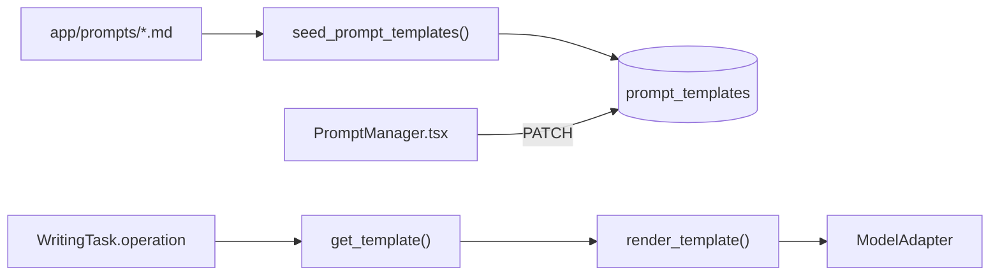

# Prompt 与 Agent 机制审计报告

审计日期：2026-06-12

## 结论摘要

当前项目有 Prompt 机制，但没有真正的 Agent 机制。

- 章节类 Prompt：6 个 Markdown 文件，首次启动 seed 到 `PromptTemplate` 表。
- 创意类 Prompt：5 个 operation guide，写死在 `routers/creative.py`。
- Adapter 层 Prompt：LM Studio no-think system wrapper。
- 健康检查 Prompt：Provider 测试中的固定短指令。
- Reflection Prompt：不存在。
- 独立 Character Checker、Plot Rhythm Checker、Revision Writer：不存在。
- 所有结构化 Prompt 都没有运行时 JSON Schema 校验。

结构化清单见 `docs/prompt_inventory.json`。

## 1. 当前 Prompt 加载机制

关键事实：

1. `services/api/app/services/prompt_store.py` 只在 key 不存在时插入文件内容。
2. 数据库已有模板后，修改 Markdown 文件不会自动覆盖数据库。
3. UI 每次保存只更新当前行并把 `version` 加一，没有保存旧版本。
4. `output_schema_json` 存在，但 `chapter_pipeline.py` 不读取它做验证。
5. 模板渲染只支持 `{{variable}}` 字符串替换，没有缺失变量检查。

## 2. 分类统计

| 类型 | 当前数量 | 说明 |
|---|---:|---|
| Role Prompt | 1 | LM Studio adapter 的统一 system wrapper |
| Workflow Prompt | 4 | 章节生成、场景扩展、故事框架、章节计划 |
| Critic Prompt | 1 | continuity check |
| Scoring Prompt | 1 | chapter review |
| Reflection Prompt | 0 | 不存在 |
| Rule Compiler Prompt | 2 | chapter summary、character state update |
| Skill Prompt | 5 | 角色方案、世界观、自由扩写、健康检查、上下文约束片段 |

同一个 Prompt 可能兼具多种属性；JSON 清单按主要用途只标一个类型。

## 3. 运行中章节 Prompt

### 3.1 chapter_generation

- 文件：`services/api/app/prompts/chapter_generation.md`
- 类型：Workflow Prompt
- 角色：小说章节写作者
- 输入：`chapter_title`、`context`
- 输出：纯正文，不是 JSON
- 硬规则：推进目标、不重复、人物一致、时间地点和世界规则一致
- 边界：明确禁止分析、提纲、代码块和 JSON
- 失败处理：Prompt 内没有；Adapter 空文本会报错
- 参数：由 Provider 默认值和 `Workspace.tsx` 的 `temperature=0.75` 合并
- Loop 迁移：可以直接成为 Draft Writer 初稿，但必须改为包含 `draft_markdown` 的 JSON envelope，或明确正文解析边界

### 3.2 chapter_summary

- 文件：`services/api/app/prompts/chapter_summary.md`
- 类型：Rule Compiler Prompt
- 输入：`chapter_title`、`chapter_content`
- 输出：JSON，字段为 summary、key_events、unresolved_conflicts、foreshadowing
- 硬规则：摘要不超过 300 字、只输出 JSON
- 边界：没有“不确定则不写”的事实边界
- 失败处理：代码尝试提取不完整 JSON 中的 `summary`；其余字段可能丢失
- 参数：自动摘要强制 `temperature=0.2`、`max_tokens>=1200`
- Loop 迁移：可拆为 State Updater 的一部分；必须改为 typed event/hook schema

### 3.3 character_state_update

- 文件：`services/api/app/prompts/character_state_update.md`
- 类型：Rule Compiler Prompt
- 输入：`characters`、`chapter_content`
- 输出：JSON `updates[]`
- 硬规则：不要把推测当事实
- 边界：有 evidence 和 confidence，但没有允许值、合并规则或删除规则
- 失败处理：解析失败时变成空 updates，任务仍可能完成
- 参数：前端通常使用 `temperature=0.2`、`max_tokens=1600`
- Loop 迁移：适合迁移到 State Updater staging 阶段；写入前必须验证 character_id 和字段白名单

### 3.4 chapter_review

- 文件：`services/api/app/prompts/chapter_review.md`
- 类型：Scoring Prompt
- 输入：`context`、`chapter_content`
- 输出：JSON，包含 score 和六类检查文字
- 硬规则：只给建议、不改正文、只输出 JSON
- 边界：没有 severity、issue id、evidence location 或 passed 判定
- 失败处理：解析失败时创建空字段 ReviewResult，仍可被视作任务成功
- 参数：前端通常使用 `temperature=0.2`、`max_tokens=1600`
- Loop 迁移：应拆成 Continuity、Character、Plot Rhythm 三个 checker；综合评分不能替代 blocker 判断

### 3.5 continuity_check

- 文件：`services/api/app/prompts/continuity_check.md`
- 类型：Critic Prompt
- 输入：`context`、`chapter_content`
- 输出：JSON `issues[]`
- 硬规则：对照 Canon、只输出 JSON
- 边界：type 和 severity 有枚举文本
- 失败处理：没有 schema 校验或修复流程
- 当前调用证据：没有 API 或 WritingTask operation 调用它
- Loop 迁移：高度适合，扩充为 passed、blocker、causality、item、location

### 3.6 outline_expand

- 文件：`services/api/app/prompts/outline_expand.md`
- 类型：Workflow Prompt
- 输入：`context`
- 输出：JSON `scenes[]`
- 硬规则：2 至 6 个顺序场景，每场必须推进目标
- 边界：场景字段固定
- 失败处理：没有 schema 校验
- 当前调用证据：没有 API 或 WritingTask operation 调用它
- Loop 迁移：可作为 Chapter Planner 的可选 scene planning 子步骤

## 4. 创意中心 Prompt

位置：`services/api/app/routers/creative.py`

这些 Prompt 没有单独文件、数据库 key、schema 或版本号。`build_prompt()` 会拼接：

1. 固定角色“本地小说创作助手”。
2. operation guide。
3. 当前小说标题、简介、总纲、风格、禁止事项。
4. 用户想法。
5. 最多 120000 字符参考材料。
6. 固定输出要求。

| operation | 当前输出 | JSON | Loop 迁移 |
|---|---|---:|---|
| `story_outline` | Markdown 框架 | 否 | 迁移到 `story_framework_builder` |
| `characters` | Markdown 角色方案 | 否 | 迁移到 `character_model_builder` |
| `worldbuilding` | Markdown 世界观 | 否 | 可并入 Story Bible Builder |
| `chapter_plan` | Markdown 表格 | 否 | 迁移到 `chapter_planner` |
| `expand` | 小说正文 | 否 | 可作为 Draft Writer 的手动模式 |

主要风险：

- 路由既负责 Prompt 又负责模型调用和持久化，耦合较高。
- 参考材料只按字符截断，没有 token 预算。
- 请求同步阻塞。
- 输出是 Markdown，自由度高，不适合自动写入结构化状态。

## 5. Adapter 和健康检查 Prompt

### LM Studio system wrapper

- 文件：`services/api/app/providers/adapters.py`
- 角色文本：本地小说创作助手，要求只输出最终结果
- 触发条件：`provider_type=lm_studio` 且 `force_no_think=true`
- 作用：通过 ChatML prefill 避免模型只消耗推理 token
- 风险：这是模型协议 workaround，不应承载业务角色；业务 Prompt 和协议 Prompt 应分离

### Provider health check

- 文件：`services/api/app/routers/model_providers.py`
- 输入：无业务数据
- 输出：期望 `OK`
- 参数：temperature 0、max_tokens 512
- 用途：验证真实生成接口，不评估小说质量
- Loop 迁移：保留为 Provider health probe，不属于故事 Agent

## 6. 动态上下文中的 Prompt 片段

`services/api/app/services/context_builder.py` 会动态生成以下 section：

- 故事总纲
- 当前章节目标
- 当前章节大纲
- 相关角色卡与状态
- 最近三章摘要
- 世界观规则
- 未解决冲突与伏笔
- 风格、禁止事项与输出要求

其中 `style_output` 包含“只输出章节正文，不解释写作过程”。这是运行时约束片段，不是独立可版本化 Prompt。

## 7. 当前 JSON 处理审计

`chapter_pipeline.parse_json_response()` 的行为：

1. 去掉首尾 Markdown JSON fence。
2. 尝试完整 `json.loads`。
3. 尝试截取第一个 `{` 到最后一个 `}`。
4. 失败时返回调用方提供的 fallback。

它没有：

- JSON Schema/Pydantic 校验。
- 必填字段检查。
- 枚举检查。
- 类型修复。
- 独立 JSON repair 模型调用。
- retry 次数记录。
- 把“解析失败”标记为 Run failure。

因此当前“只输出 JSON”是软约束，不是可执行契约。

## 8. Prompt 到 Loop Agent 的迁移矩阵

| 当前 Prompt | 保留 | 改造方向 |
|---|---:|---|
| chapter_generation | 是 | Draft Writer；输出结构化 envelope |
| chapter_summary | 部分 | 拆入 State Updater 和长期摘要 |
| character_state_update | 是 | staging + schema + 人工/代码校验 |
| chapter_review | 部分 | 拆成三个 checker |
| continuity_check | 是 | 扩展 issue schema 并接入状态机 |
| outline_expand | 是 | Chapter Planner 子步骤 |
| creative story_outline | 是 | 改为 story_framework_builder JSON |
| creative characters | 是 | 改为 character_model_builder JSON |
| creative worldbuilding | 是 | 改为 Story Bible 结构化条目 |
| creative chapter_plan | 是 | 改为 chapter_planner JSON |
| creative expand | 可选 | 作为手动写作工具，不进入自动 Canon |

## 9. 必须新增的 Prompt 类型

当前完全缺失：

- Character Consistency Checker
- Plot Rhythm Checker
- Revision Writer
- Timeline Builder
- State Updater 的完整版本
- Reflection Agent
- JSON Repair Prompt

其中 JSON Repair 应只接收无效输出、目标 schema 和错误信息，不应接收整个故事上下文。

## 10. 审计建议

1. 保留现有 PromptTemplate 表，但新增不可变 PromptVersion。
2. 把创意 Prompt 从 `creative.py` 移入统一 registry。
3. 每个 Agent 绑定唯一 input schema、output schema 和参数 preset。
4. `PromptTemplate.output_schema_json` 必须由 `JsonGuard` 实际执行。
5. 解析失败不能静默落空；应记录 `PARSE_ERROR` 并进入最多一次 JSON repair。
6. 正文也使用 JSON envelope，只有 `draft_markdown` 字段允许长文本。
7. Prompt 只定义语义任务；超时、retry、轮次、停止条件全部由代码实现。
8. Reflection 只能提出规则候选，不能直接修改生产 Prompt。
