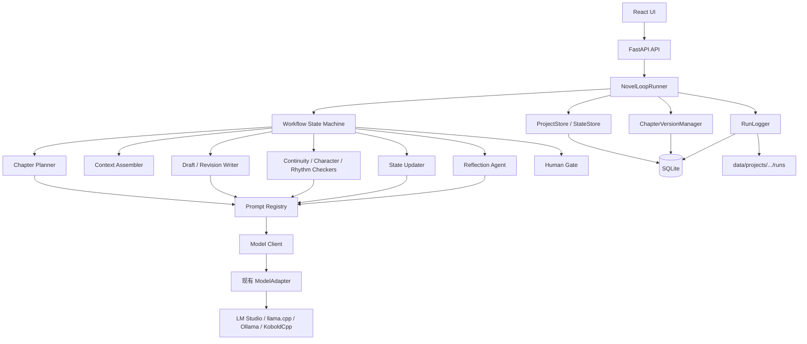
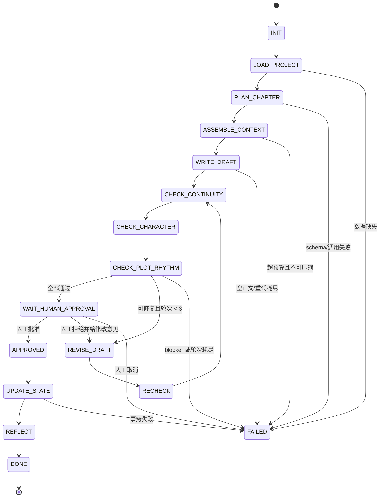

# 小说 Loop Agent 目标架构

## 1. 产品定位

### 系统做什么

Novel Loop Agent 是运行在本地 macOS 上的单用户小说续写工作台。它从已经确认的故事框架、角色卡、世界规则、时间线和章节计划出发，用代码驱动单章生成、检查、修订、人工确认和状态更新。

### 目标用户

- 有明确故事框架，希望稳定逐章写作的个人作者。
- 希望主要使用 LM Studio、llama.cpp、Ollama 等本地模型的用户。
- 需要检查人物、时间线、伏笔和世界规则一致性的长篇创作者。
- 希望每次生成可追踪、可恢复、可回退，而不是依赖一次长对话的用户。

### 解决的问题

1. 长篇上下文无法全部塞进单次 Prompt。
2. 模型可能生成空文本、无效 JSON、跑题或设定冲突。
3. 本地大模型加载和生成较慢，不能把流程控制也交给模型。
4. 多次修订会覆盖历史，难以比较和回退。
5. 生成失败后缺少明确恢复点。

### 为什么采用 Loop Agent

“Loop”不是让模型无限自我讨论，而是由状态机重复执行有限且可观察的步骤。模型只处理语义任务；代码决定下一步、重试、停止、写入和人工 gate。

## 2. 架构原则

1. **SQLite 是结构化事实的主存储**：项目、角色、时间线、Hook、Run 和版本均持久化。
2. **文件是可导出和大文本工件**：每个 run 可选保存 Prompt、原始输出、diff 和最终 Markdown。
3. **每次模型调用都绑定 run_id、step_id、prompt_key 和 schema_version**。
4. **检查输出必须结构化**；正文只允许出现在 JSON 的 `draft_markdown` 或 `revised_markdown` 字段。
5. **写入 Canon 前必须 approved**。
6. **单章最多修订三轮**。
7. **blocker 不允许自动降级为通过**。
8. **前端断开不影响后端状态机继续或停在 gate**。
9. **同一章节默认只允许一个 active loop run**。
10. **Prompt 和模型输出不直接决定数据库写入方式**。

## 3. 目标架构



## 4. 目标模块

| 模块 | 职责 | 是否调用模型 | 当前可复用基础 |
|---|---|---:|---|
| Project Manager | 项目、小说和运行配置 | 否 | `Project`、`Novel` 路由 |
| Story Bible Manager | 世界规则、地点、组织、物品和 Canon | 可选抽取 | `WorldRule`、`CanonState` |
| Character Manager | 人物模型、状态、关系 | 可选抽取 | `Character` |
| Timeline Manager | 事件顺序、故事时间、因果 | 可选抽取 | `TimelineEvent` 表 |
| Chapter Planner | 生成/整理章节任务卡 | 是 | `ChapterOutline`、`outline_expand` |
| Context Assembler | 查询、排序、裁剪最小上下文 | 默认否 | `context_builder.py` |
| Draft Writer | 生成初稿 | 是 | `chapter_generation` |
| Continuity Checker | 设定、时间线、道具、地点和因果 | 是 | 未接入的 `continuity_check` |
| Character Checker | 行为、语气、动机和关系推进 | 是 | 无独立实现 |
| Plot Rhythm Checker | 目标、冲突升级、信息密度、结尾钩子 | 是 | `chapter_review` 可拆分 |
| Revision Writer | 按 issue 清单修订 | 是 | 不存在 |
| State Updater | 从 approved 章节抽取状态变化 | 是 + 代码校验 | `chapter_summary`、`character_state_update` |
| Reflection Agent | 总结重复错误和规则候选 | 是 | 不存在 |
| Human Gate | 预览、diff、批准、拒绝 | 否 | 当前人工编辑思路 |
| Run Logger | 记录 step、输入、输出、错误、耗时 | 否 | `GenerationRun` |

## 5. 推荐目录结构

不建议立即把现有仓库改名或搬成全新 `frontend/backend`。先沿用当前 monorepo，增量增加 Loop 模块：

```text
novel-local-ai/
├── apps/web/
│   └── src/
│       ├── components/              # 保留现有页面
│       ├── features/loop-runs/      # 新增章节运行、检查、diff、日志
│       ├── services/api.ts
│       └── types.ts
├── services/api/app/
│   ├── routers/
│   │   └── loop_runs.py             # 新 API，不改旧章节 API
│   ├── workflow/
│   │   ├── runner.py
│   │   ├── states.py
│   │   ├── transitions.py
│   │   └── policies.py
│   ├── agents/
│   │   ├── base.py
│   │   ├── planner.py
│   │   ├── writer.py
│   │   ├── checkers.py
│   │   ├── state_updater.py
│   │   └── reflection.py
│   ├── prompts/
│   │   ├── novel_loop/
│   │   └── ...                      # 保留现有 Prompt
│   ├── services/
│   │   ├── context_builder.py       # 逐步升级
│   │   ├── json_guard.py
│   │   ├── run_logger.py
│   │   ├── version_manager.py
│   │   └── state_store.py
│   ├── models/
│   │   └── loop_entities.py
│   └── schemas/
│       └── loop.py
├── data/projects/
│   └── <project_id>/
│       ├── bible/
│       ├── characters/
│       ├── plot/
│       ├── state/
│       ├── chapters/
│       ├── memory/
│       ├── eval/
│       └── runs/<run_id>/
└── docs/
```

MVP 1 可先只使用 SQLite；`data/projects/` 用于导出和调试工件，不应成为第二套可修改主数据。

## 6. 推荐数据结构

### NovelProject

```json
{
  "project_id": "uuid",
  "novel_id": "uuid",
  "title": "string",
  "default_provider_id": "uuid",
  "workflow_policy": {
    "max_revision_rounds": 3,
    "max_model_retries": 2,
    "require_human_approval": true
  }
}
```

复用当前 `Project`、`Novel`，新增配置字段或独立 `ProjectWorkflowConfig`。

### StoryBible

```json
{
  "world_rules": [],
  "locations": [],
  "organizations": [],
  "items": [],
  "canon_facts": [],
  "forbidden_contradictions": []
}
```

### CharacterProfile

```json
{
  "character_id": "uuid",
  "name": "string",
  "role": "string",
  "desire": "string",
  "fear": "string",
  "misbelief": "string",
  "external_goal": "string",
  "internal_arc": "string",
  "speech_style": "string",
  "forbidden_behaviors": []
}
```

### ChapterPlan

```json
{
  "chapter_id": "uuid",
  "goal": "string",
  "required_events": [],
  "required_characters": [],
  "required_locations": [],
  "hooks_to_plant": [],
  "hooks_to_resolve": [],
  "emotional_curve": [],
  "ending_hook": "string",
  "forbidden_moves": []
}
```

### ChapterDraft / ChapterVersion

```json
{
  "version_id": "uuid",
  "chapter_id": "uuid",
  "run_id": "uuid",
  "revision_round": 0,
  "kind": "draft|revision|human_edit|approved",
  "content_markdown": "string",
  "parent_version_id": "uuid|null",
  "content_hash": "sha256",
  "created_at": "datetime"
}
```

### CheckReport

```json
{
  "report_id": "uuid",
  "run_id": "uuid",
  "version_id": "uuid",
  "checker": "continuity|character|plot_rhythm",
  "passed": false,
  "severity": "major",
  "issues": [],
  "raw_output_ref": "string"
}
```

### RevisionTask

```json
{
  "revision_round": 1,
  "source_version_id": "uuid",
  "issue_ids": [],
  "must_fix": [],
  "preserve": [],
  "status": "pending|completed|failed"
}
```

### TimelineEvent

在当前表基础上增加稳定 `event_id`、cause/effect、状态变化和证据版本。

### CharacterState

```json
{
  "character_id": "uuid",
  "as_of_chapter_id": "uuid",
  "location_id": "uuid|null",
  "physical_state": {},
  "emotional_state": {},
  "knowledge": [],
  "inventory": [],
  "relationship_deltas": []
}
```

### HookRecord

```json
{
  "hook_id": "uuid",
  "description": "string",
  "status": "planned|planted|reinforced|resolved|abandoned",
  "planted_chapter_id": "uuid|null",
  "target_resolution_chapter_id": "uuid|null",
  "resolved_chapter_id": "uuid|null"
}
```

### RunLog

建议拆为：

- `ChapterLoopRun`：整个章节闭环。
- `RunStep`：一次状态步骤。
- `ModelCall`：一次模型调用和解析结果。
- `RunEvent`：状态变化、人工操作和错误事件。

## 7. Workflow 状态机



`WAIT_HUMAN_APPROVAL` 必须是持久状态；后端重启后仍可继续 approve/reject。

## 8. 模型调用边界

| 步骤 | 是否调用模型 | 边界 |
|---|---:|---|
| LOAD_PROJECT | 否 | 代码读取和验证 |
| PLAN_CHAPTER | 可选/是 | 已有完整计划时跳过 |
| ASSEMBLE_CONTEXT | 默认否 | 只有摘要压缩时调用模型 |
| WRITE_DRAFT | 是 | 只生成当前章 |
| CHECK_CONTINUITY | 是 | 输入 Canon + draft + plan |
| CHECK_CHARACTER | 是 | 输入相关角色和 draft |
| CHECK_PLOT_RHYTHM | 是 | 输入 plan + draft，不需要完整 Bible |
| REVISE_DRAFT | 是 | 只接收原文、issue 和保留项 |
| RECHECK | 否 | 状态机动作；重新调用三个 checker |
| WAIT_HUMAN_APPROVAL | 否 | 前端操作 |
| UPDATE_STATE | 是 + 代码 | 模型抽取，代码验证和事务写入 |
| REFLECT | 是 | 只产生规则候选，不自动修改 Prompt |

## 9. 必须由代码实现

- 文件和数据库加载
- run_id、step_id、version_id 生成
- schema 校验
- JSON fence 清理和最多一次 repair
- HTTP timeout 与有限 retry
- Provider fallback policy
- 章节级互斥锁
- 幂等请求键
- Prompt/response 持久化
- 章节版本追加和 diff
- revision round 计数
- blocker 和停止条件判断
- Human Gate
- State staging、校验和事务提交
- 错误分类
- 前端断线后的状态恢复
- 用户取消标记

## 10. 停止条件

| 条件 | 行为 |
|---|---|
| 修订达到 3 轮仍未通过 | 状态变为 FAILED，保留最后版本和全部报告 |
| 任一 checker 返回 blocker | 不自动修订或 approved，进入人工处理 |
| 单次调用 timeout | 最多重试 2 次；仍失败则 FAILED |
| JSON 解析失败 | 本地清理一次，模型 repair 一次；仍失败则该 step FAILED |
| 正文为空 | 视为模型调用失败，不生成 ChapterVersion |
| 项目 Canon 缺少必要字段 | LOAD_PROJECT 或 ASSEMBLE_CONTEXT 失败 |
| 用户取消 | 设置 cancel_requested；当前请求返回后停止写入下一状态 |
| 人工未批准 | 永远停在 WAIT_HUMAN_APPROVAL，不自动进入 Canon |

## 11. 从当前项目到目标架构的映射

| 当前能力 | 目标复用 |
|---|---|
| `ModelAdapter` | 作为 ModelClient 的 transport |
| `WritingTask` | 可暂时承载单个 run 调度，后续由 ChapterLoopRun 聚合 |
| `GenerationRun` | 迁移/扩展为 ModelCall |
| `Context Builder` | 改为 typed sections 和优先级裁剪 |
| `PromptTemplate` | 增加版本实体和 schema enforcement |
| `CanonState` | 先保留，再逐步拆出 CharacterState/Hook/Timeline |
| `ReviewResult` | 兼容旧审稿；新检查使用 CheckReport |
| `Chapter.version` | 保留展示计数；真实历史改用 ChapterVersion |

## 12. 一致性和并发策略

1. 创建 run 时检查同章 active run；冲突返回 HTTP 409。
2. 每次状态迁移使用数据库事务和 `expected_state` 乐观锁。
3. `ChapterVersion` 只追加，不更新正文。
4. approved 时才把目标版本复制到 `Chapter.content`，保持旧 API 兼容。
5. State Updater 写入 staging；通过 schema 和引用完整性检查后一次提交。
6. run 失败不回滚已经保存的日志和版本工件。

## 13. 最小可行闭环

MVP 1 只需要：

1. 读取现有 ChapterOutline、CanonState 和相关实体。
2. 代码组装上下文。
3. Draft Writer 生成结构化初稿。
4. Continuity Checker 生成结构化报告。
5. 不通过时最多修订一次，重新检查一次。
6. 停在 Human Gate。
7. 人工批准后更新 Chapter.content、summary 和 Canon staging。

Character Checker、Plot Rhythm Checker 和 Reflection 可以先使用简单实现或随后加入，但最终状态机接口应从一开始保留。
