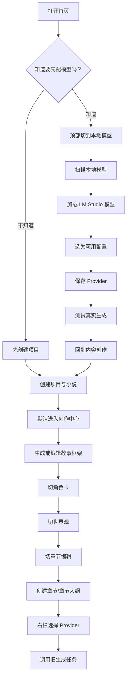
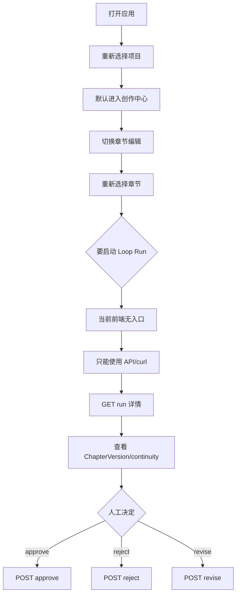
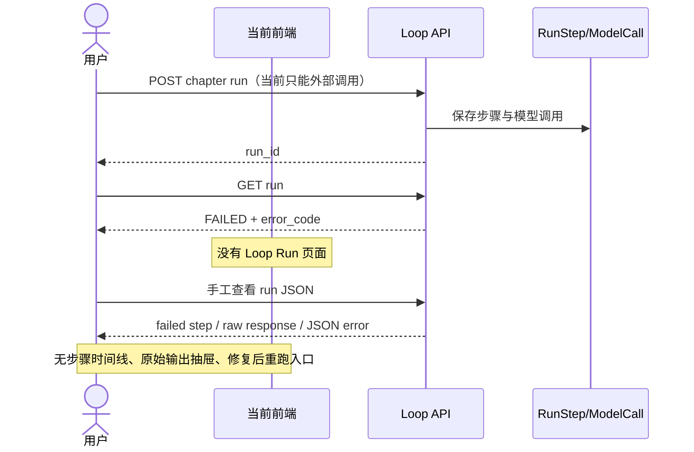

# 前端页面结构与操作流程审计

## 1. 审计范围

本报告基于：

- `apps/web/src/` 当前代码。
- `docs/01` 到 `docs/08`。
- 当前首页、项目工作区、模型配置页面形态。
- MVP 1.1 已实现的 Loop API、审批与版本能力。

本轮只审计和设计，不修改前端运行代码。

## 2. 前端技术栈

| 项目 | 当前实现 | 证据与影响 |
| --- | --- | --- |
| React | React 18.3.1 | `apps/web/package.json` |
| 构建工具 | Vite 8.0.16 + `@vitejs/plugin-react` | 开发端口 5173，`/api` 代理至 8000 |
| TypeScript | TypeScript 6.0.3，strict | build 先执行 `tsc --noEmit` |
| Router | 无 React Router | 页面由 `App.tsx` 和 `WorkspaceShell.tsx` 的 `useState` 切换 |
| 状态管理 | 无 Zustand/Redux/Context store | 所有状态分散在页面组件本地 |
| 组件库 | 无 | 使用原生表单、Tailwind utility 和少量共享 CSS class |
| CSS | Tailwind CSS 3.4.10 + `index.css` | 自定义 `panel`、`field`、`btn-*`；统一纸张/墨色风格 |
| 响应式 | 桌面优先 | `body { min-width: 1024px; }`，当前明确不支持窄屏 |
| API 封装 | `src/services/api.ts` | 单一 `api<T>()` fetch wrapper；错误只保留 status/message |
| 类型定义 | `src/types.ts` | 包含旧实体；尚无 ChapterLoopRun、RunStep、ModelCall、ChapterVersion 类型 |
| 前端测试 | 无 | 未配置 Vitest、Testing Library 或 Playwright |

### Vite 配置

```text
Vite dev server: 127.0.0.1:5173
/api proxy:       127.0.0.1:8000
```

没有环境变量级 API base URL、构建时 feature flag 或 route base 配置。

## 3. 当前页面清单

当前不是 URL 驱动的多页面应用。下表中的“路径”是逻辑页面，不是浏览器路由。

| 逻辑页面 | 组件路径 | 入口 |
| --- | --- | --- |
| 全局 App Shell | `src/App.tsx` | 应用入口 |
| 项目首页 | `components/Dashboard.tsx` | `page=content` 且未选择项目 |
| 项目工作区 Shell | `components/WorkspaceShell.tsx` | 打开项目后 |
| 创作中心 | `components/CreativeStudio.tsx` | 项目内默认 tab |
| 章节编辑 | `components/Workspace.tsx` | 项目内“章节编辑” |
| 角色卡 | `components/CharacterCards.tsx` | 项目内“角色卡” |
| 世界观 | `components/Worldbuilding.tsx` | 项目内“世界观” |
| Prompt 管理 | `components/PromptManager.tsx` | 项目内“Prompt 模板” |
| 模型配置 | `components/ModelSettings.tsx` | 顶部“本地模型” |
| 本地模型中心 | `components/LocalModelCenter.tsx` | 模型配置页下半部分 |
| 旧任务运行视图 | `Workspace.tsx` 右侧栏 | GenerationRun/details |
| Loop Run 页面 | 不存在 | 后端 API 已有，前端未接入 |
| ChapterVersion 页面 | 不存在 | 后端返回版本，前端无类型与视图 |
| 独立 Runs/Logs 页面 | 不存在 | 旧 GenerationRun 嵌在章节右栏 |
| Timeline 页面 | 不存在 | 只有后端实体，当前无 UI |
| Settings 页面 | 不存在 | Provider 设置承担部分全局设置职责 |

## 4. 页面职责与缺口

### 4.1 App Shell

- 文件：`apps/web/src/App.tsx`
- 目标：加载项目、切换“内容创作/本地模型”、保存当前项目与小说。
- 主要状态：`page`、`projects`、`activeProject`、`activeNovel`、`error`。
- API：`GET /projects`、`GET /projects/{id}`。
- 操作：进入首页、模型页、项目工作区。
- 缺口：
  - URL 永远不表达当前页面、项目、tab、章节或 run。
  - 刷新后回到首页。
  - 浏览器前进/后退无效。
  - 只能打开项目中的第一本 novel。
  - 顶部导航无法表达 Runs、Prompts、Settings 等一级概念。

### 4.2 Projects 首页

- 文件：`components/Dashboard.tsx`
- 目标：显示项目、创建项目和第一本小说。
- 主要状态：创建表单、busy、localError。
- API：项目创建/删除、小说创建。
- 操作：打开、删除、创建并进入工作区。
- 缺口：
  - 项目卡没有小说标题、章节数、最近章节、最近 run、待审批数量或模型健康度。
  - 创建表单永久占据约 35% 主区域，项目越多越显得失衡。
  - 没有“继续写作”或“下一步”主动作。
  - 没有模型未配置的新手引导。
  - 删除是卡片唯一的次级动作，信息价值偏低、破坏性动作偏显眼。

### 4.3 Workspace Shell

- 文件：`components/WorkspaceShell.tsx`
- 目标：显示当前项目/小说并切换项目内五个 tab。
- 状态：本地 `tab`，默认 `create`。
- API：无直接调用。
- 操作：返回项目、切换创作/章节/角色/世界观/Prompt。
- 缺口：
  - tab 刷新后丢失。
  - Prompt 是全局运行配置，却被放在单个项目内部。
  - 没有 Overview、Runs、Versions、Logs。
  - 当前小说位置可见，但“当前章节”和“下一步动作”不可见。
  - tab 横向平铺，功能扩展后会拥挤。

### 4.4 创作中心

- 文件：`components/CreativeStudio.tsx`
- 目标：从想法或素材生成框架、角色方案、世界观、章节计划或扩写文本。
- 状态：provider、operation、idea、referenceText、result、CreativeRun、busy/message。
- API：model providers、creative runs、novel patch、chapter list/create。
- 操作：上传 txt/md、选择模型、生成、编辑结果、写入总纲、创建章节。
- 优点：
  - “想法到结构”的入口清晰。
  - 模型选择压缩为单个下拉框。
  - AI 结果可编辑后再写入。
- 缺口：
  - 五种 operation 同级，缺少基于项目成熟度的推荐。
  - “写入故事总纲”和“作为新章节大纲”是数据写入动作，但缺少变更预览。
  - CreativeRun 与 Loop Run 是两套运行概念，用户无法区分。
  - 上传素材没有持久化素材库。

### 4.5 章节编辑

- 文件：`components/Workspace.tsx`
- 目标：章节树、总纲、正文编辑、旧生成任务、上下文、Canon、审稿和日志。
- 状态：20 余个局部状态，包括 chapters、providers、task、context、runs、reviews、canon。
- API：章节、角色、Provider、Canon、旧 WritingTask、GenerationRun、ReviewResult、Context Preview。
- 操作：编辑正文/大纲、旧接口生成、摘要、审稿、人物状态、暂停/重试、导出。
- 优点：
  - 三栏结构符合长文本写作习惯。
  - 正文始终可人工编辑。
  - 上下文和旧 GenerationRun 可审计。
- 缺口：
  - 单页同时承担编辑器、总纲、生成控制、Canon 编辑、审稿和原始日志，认知密度过高。
  - “生成章节”仍调用旧 `/chapters/{id}/generate`，不是新 Loop API。
  - 旧生成会更新 Chapter.content；新 Loop 生成 ChapterVersion 并等待审批，两种行为在 UI 中没有区分。
  - 任务进度是 WritingTask progress，不是 Loop 状态机。
  - `waitUntilIdle()` 最多轮询 360 秒，没有明确“前端停止观察但后端仍运行”的提示。
  - 完成消息读取创建时 task 状态，可能与最终状态不一致。
  - 原始日志塞在狭窄右栏，长 prompt/response 难读。
  - Canon JSON 可直接编辑，适合工程调试，不适合作为默认产品交互。

### 4.6 角色卡

- 文件：`components/CharacterCards.tsx`
- 目标：角色 CRUD。
- API：character list/create/update/delete。
- 操作：选择、新增、编辑、删除。
- 缺口：
  - 当前状态和关系要求用户直接编辑 JSON。
  - 无未保存提示、错误捕获和字段级校验。
  - 无角色参与章节、最近变化、知识边界摘要。
  - 保存反馈是短文本，切换角色后容易失去上下文。

### 4.7 世界观

- 文件：`components/Worldbuilding.tsx`
- 目标：世界规则 CRUD。
- API：world-rule list/create/update/delete。
- 操作：分类、优先级、描述。
- 缺口：
  - Location、Organization、Item 只是 category，不是独立视图。
  - 无规则冲突、引用章节或“是否进入当前上下文”的反馈。
  - 保存和删除缺少统一消息/错误状态。

### 4.8 Prompt Manager

- 文件：`components/PromptManager.tsx`
- 目标：编辑数据库中的 PromptTemplate。
- API：list、patch。
- 操作：选择、编辑、保存。
- 缺口：
  - 位于项目内，实际却影响所有项目。
  - 无 schema、变量清单、测试运行、diff 或回滚。
  - “保存新版本”只增加数字，旧版本不可查看。
  - 对普通写作者过于技术化，应放在 Advanced/Settings。

### 4.9 Model Configuration

- 文件：`components/ModelSettings.tsx`
- 目标：Provider CRUD、参数预设、连接测试。
- 状态：providers、selectedId、form、message、inventory。
- API：provider CRUD/test、local inventory。
- 操作：创建/编辑/删除/测试、套用实验参数、从本地模型生成配置。
- 优点：
  - 支持多个本地运行时。
  - 有默认参数、参数说明、实验方案。
  - 能显示测试状态。
- 缺口：
  - 没有“默认写作/检查/摘要模型”的角色分配。
  - “本机已下载模型”“当前已加载模型”“可调用 Provider 配置”混在同一长页面。
  - 测试失败被压缩到单行 message，缺少错误类别、请求目标、建议修复。
  - 无最后测试时间、当前被哪些项目/任务使用。
  - 页面同时承担配置、教学、模型库存、加载管理，纵向过长。
  - 删除 Provider 会影响未来调用，但缺少依赖提示。

### 4.10 Local Model Center

- 文件：`components/LocalModelCenter.tsx`
- 目标：扫描本机模型、筛选、加载/卸载 LM Studio、生成 Provider 配置。
- API：inventory、LM Studio load/unload。
- 缺口：
  - 扫描结果和 Provider 配置之间的关系需要用户自行理解。
  - “当前运行模型”不等于“写作工作区正在使用的 Provider”，文案容易造成误解。
  - 推荐用途为模型级，但没有落到 Writer/Checker/Summary 角色。

## 5. 当前跳转逻辑

### 顶部导航

`App.tsx` 使用：

```text
page = content | models
```

这是组件条件渲染，不是 URL route。

### 项目进入

1. 点击项目卡。
2. `GET /projects/{id}`。
3. 取 `project.novels[0]`。
4. 设置 activeProject/activeNovel。
5. 渲染 WorkspaceShell，默认进入“创作中心”。

### 创建项目后

1. POST Project。
2. POST Novel。
3. 刷新项目列表。
4. 自动调用 openProject。
5. 进入 WorkspaceShell 的默认“创作中心”。

### 模型保存

- 新配置：POST `/model-providers`。
- 编辑：PATCH `/model-providers/{id}`。
- 保存后不自动测试，只提示用户测试。
- 测试：POST `/model-providers/{id}/test`。

### 返回、刷新、深链

| 能力 | 当前情况 |
| --- | --- |
| 返回项目列表 | WorkspaceShell 内部按钮 |
| 浏览器 Back | 不支持语义返回 |
| 刷新恢复 | 不支持 |
| 项目深链 | 不支持 |
| 章节深链 | 不支持 |
| run 深链 | 不支持 |
| 复制当前 URL 分享/收藏 | 无意义 |

## 6. 核心用户路径

### 路径 A：新用户第一次使用



摩擦点：入口顺序不明确；模型页与项目页之间没有 onboarding 状态；最后启动的是旧任务而不是 Loop。

### 路径 B：老用户继续写小说



摩擦点：MVP 1.1 的主价值完全没有产品化；刷新无法回到 run；用户看不到待审批任务。

### 路径 C：模型配置失败

```mermaid
flowchart TD
    A["新增 Provider"] --> B["填写类型/Base URL/Model/Timeout/API Key"]
    B --> C["保存"]
    C --> D["测试真实生成"]
    D --> E{"测试成功？"}
    E -->|是| F["状态显示测试通过"]
    E -->|否| G["顶部单行 message 显示错误"]
    G --> H{"用户能否判断原因？"}
    H -->|端口/模型名明显| I["修改字段并保存"]
    H -->|超时/服务/协议不明确| J["离开页面自行排查"]
    I --> D
    J --> I
```

缺少：错误分类、请求 URL、建议动作、当前服务/模型加载状态、复制诊断信息。

### 路径 D：Loop Run 失败



## 7. 为什么操作别扭

### 7.1 信息架构

1. 顶部“内容创作/本地模型”过粗，只表达领域，不表达用户任务。
2. 全局配置 Prompt 被放入项目内；Runs/Logs 没有全局入口。
3. 创意生成、旧 WritingTask、新 Loop Run 是三套运行模型，没有统一命名和位置。
4. 项目工作区默认进入“创作中心”，不是“项目总览/继续写作”。
5. 用户看不到待审批 run，因此“下一步”不明确。

### 7.2 页面布局

1. 首页创建表单长期占据右栏，应改成主按钮触发 modal/drawer。
2. 项目卡缺少进度、当前章节、待审批和模型状态。
3. Workspace 右栏塞入生成、上下文、Canon、审稿、日志，层级不清。
4. 模型页过长，配置、库存、加载、参数教学没有折叠成清晰任务。
5. 项目内需要稳定侧栏或二级导航；横向 tab 不足以承载 MVP 2。

### 7.3 操作反馈

1. 保存反馈多为局部字符串，缺少一致 toast、dirty state 和失败重试。
2. Provider 测试失败只有 message，没有诊断结构。
3. 旧任务有粗略 progress，但新 Loop 没有时间线、当前 step 或后台运行反馈。
4. 没有全局“正在运行/等待审批/失败”状态入口。
5. approve 的关键后果没有 UI：用户不知道只有 approve 才更新正式正文。

### 7.4 认知负担

1. 新用户不知道“先配置模型”还是“先建项目”。
2. Provider 是协议配置，但页面同时把它呈现为“模型”，概念混用。
3. 用户不知道正文模型、检查模型、摘要模型是否应不同。
4. 用户不知道 AI 结果是 CreativeRun 文本、正式 Chapter.content，还是 ChapterVersion。
5. 直接编辑 Canon JSON 和角色状态 JSON 会把工程结构暴露给普通写作者。

## 8. 风险与设计约束

1. 不应为视觉统一而重写全部页面。
2. 不应删除旧 Workspace 或旧生成任务；先明确标识“Legacy generation”。
3. 不引入大型 UI 框架，继续使用 Tailwind 和小型本地组件。
4. 不把 Overview、Editor、Run、Version、Logs 全塞进一个三栏页面。
5. 前端不能绕过 approve API 直接写入 AI draft。
6. 前端不能直接把 ModelCall 输出写入 Canon。
7. 前端不能自行推断 run 已完成，必须以持久化 API 状态为准。
8. Prompt 与原始输出可能包含私人小说内容，日志默认应折叠并标记敏感。

## 9. 审计结论

当前前端是一个视觉统一、功能覆盖较广的桌面型 SPA，但信息架构仍停留在“组件集合”。MVP 2 的首要工作不是换皮，而是建立三层位置感：

```text
全局：Projects / Runs / Models / Prompts / Settings
项目：Overview / Story Bible / Characters / Chapters / Runs / Versions / Logs
章节：正文 / 当前版本 / 当前 run / 审批动作
```

最先应改的是项目进入后的默认页面：从“创作中心”改为 Project Overview，并把“继续当前章节”和“处理待审批 Run”作为两个主动作。
