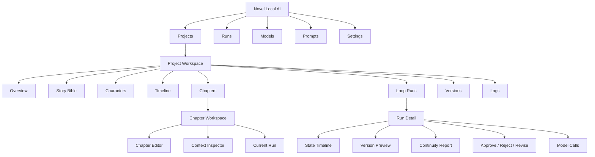

# MVP 2 前端信息架构

## 1. 产品目标

用户进入任何项目后，应在五秒内回答：

1. 我在哪本小说里？
2. 下一步应该写或处理哪一章？
3. 当前 Loop Run 到了哪一步，是否等待审批？

## 2. 推荐信息架构



## 3. 页面树与推荐 URL

Router 在 Phase 6 正式引入；以下 URL 是目标结构。

```text
/projects
/projects/:projectId/overview
/projects/:projectId/story-bible
/projects/:projectId/characters
/projects/:projectId/timeline
/projects/:projectId/chapters
/projects/:projectId/chapters/:chapterId
/projects/:projectId/runs
/projects/:projectId/runs/:runId
/projects/:projectId/versions
/projects/:projectId/logs
/runs
/models
/prompts
/settings
```

MVP 2 第一阶段只需：

```text
/projects
/projects/:projectId/overview
/projects/:projectId/chapters/:chapterId
/projects/:projectId/runs/:runId
/models
```

## 4. 导航逻辑

### 全局导航

推荐左侧窄栏或顶部主导航：

- Projects
- Runs
- Models
- Prompts
- Settings

Runs 是全局入口，用于发现所有 waiting/failed/running run。Prompts 和 Settings 不再放入项目 tab。

### 项目导航

进入项目后显示：

- 项目名与小说名。
- 项目二级 tab。
- 当前模型健康状态。
- 待审批数量。
- “继续写作”主动作。

### 章节导航

章节树始终保留状态标记：

```text
Outlined
Draft
Running
Waiting approval
Approved
Failed
```

点击章节进入编辑器；若有 active/waiting run，显示“打开 Run”，不重复创建。

## 5. Project Workspace 布局

```text
┌ Global Nav ───────────────────────────────────────────────────┐
│ Projects  Runs  Models  Prompts  Settings                    │
├ Project Header ───────────────────────────────────────────────┤
│ 项目 / 小说名        Model: Writer OK · Checker OK  2 待审批 │
├ Project Tabs ─────────────────────────────────────────────────┤
│ Overview Bible Characters Timeline Chapters Runs Versions Logs│
├ Content ──────────────────────────────────────────────────────┤
│ 当前 tab 内容                                                │
└───────────────────────────────────────────────────────────────┘
```

不要让全局导航、项目导航和章节工具混成一排。

## 6. Project Overview

Overview 是项目默认页，负责恢复上下文，不负责深度编辑。

主要模块：

1. Next Action：继续章节或处理待审批 run。
2. Progress：章节总数、已批准、待写、失败。
3. Recent Chapters。
4. Active/Waiting Runs。
5. Story Bible completeness。
6. Model health。

优先级：

```text
等待审批 > 运行失败 > 正在运行 > 继续未完成章节 > 创建第一章
```

## 7. Chapter Workspace

### 左栏

- 章节树。
- 状态 badge。
- 搜索/筛选。
- 新建章节。

### 中栏

切换：

- Published Content：当前 Chapter.content。
- Run Version：当前 draft/revision。
- Compare：版本 diff，Phase 5。

### 右栏

Context Inspector：

- 本章目标。
- 大纲。
- 相关角色。
- 关键世界规则。
- token budget。
- 当前 run 摘要。

右栏不默认展示完整 prompt/response。

## 8. 单章 Loop Run 页面

页面分为四层：

1. Run Header：状态、章节、Provider、开始时间、错误码。
2. State Timeline：LOAD_PROJECT 至 WAIT/APPROVED/FAILED。
3. Review Workspace：版本正文 + continuity report。
4. Decision Bar：approve/reject/revise。

审批规则：

- 只有 `WAIT_HUMAN_APPROVAL` 显示三个动作。
- approve 前显示“尚未写入正式章节”。
- approve 弹出确认，说明将覆盖当前 Chapter.content 为所选版本。
- reject 要求可选原因。
- revise 必须输入反馈。
- 请求发送后按钮锁定，以 API 最终状态为准。

## 9. 模型配置页改造

### 9.1 顶部角色分配

最上方显示：

| 角色 | 当前配置 | 状态 | 动作 |
| --- | --- | --- | --- |
| Writer | LM Studio / qwen... | Available | Change |
| Checker | LM Studio / qwen... | Available | Change |
| Summary | Same as Checker | Inherited | Override |

当前后端没有正式“默认角色映射”实体，前端不能写死。MVP 2 可先 feature flag + local preference 草案，正式持久化需要后端设置 API。

### 9.2 Provider 配置

第二层才是 Provider list/editor：

- 连接信息。
- 最近测试。
- 错误详情。
- 使用中的任务角色。
- 高级参数折叠区。

### 9.3 本地模型库存

第三层：

- Downloaded。
- Loaded。
- API Available。
- Configured。

用四个明确状态，不再只用“当前实际使用”。

### 9.4 测试错误

错误卡应包含：

```text
Category: MODEL_TIMEOUT / CONNECTION_REFUSED / MODEL_NOT_FOUND / HTTP_ERROR
Target:   http://127.0.0.1:1234/v1
Model:    alias
Latency:  -
Detail:   ...
Try:
1. Start LM Studio server
2. Load the model
3. Verify alias
4. Increase timeout
```

## 10. 首页改造

1. 项目列表占满主区域。
2. 创建项目改为右上角主按钮，打开 modal/drawer。
3. 顶部增加：
   - 最近项目。
   - 待审批 run。
   - 模型健康状态。
4. 项目卡增加：
   - 小说标题。
   - `approved / total chapters`。
   - 最近章节。
   - 最近 run 状态。
   - “继续写作”主按钮。
5. 删除移入 `...` 菜单。

## 11. 空状态

| 场景 | 文案 | 主动作 |
| --- | --- | --- |
| 无项目 | 从第一本本地小说开始 | 创建项目 |
| 无 Provider | 写作前连接一个本地模型 | 打开 Models |
| 无章节 | 总纲已准备好，创建第一章 | 创建章节 |
| 无角色 | 角色卡会进入章节上下文 | 创建角色 |
| 无 Run | 章节大纲准备后可启动 Loop | 启动 Run |
| 无日志 | 运行后会保存 step 和 model call | 返回章节 |

空状态必须解释价值，而不只是“没有数据”。

## 12. 错误状态

### 页面级

- 后端不可达：显示重试、API 地址和健康检查。
- 项目不存在：返回 Projects。

### Run 级

- 展示 error_code、失败 step、简短解释。
- 提供“查看原始输出”。
- 提供“修复 Provider”“编辑 Prompt”“创建新 Run”链接。
- 不把“retry”写成无条件动作；当前 Loop API 没有 retry endpoint。

### 表单级

- JSON 参数错误应定位行/字段。
- 保存失败保留用户输入。
- 破坏性动作使用确认 modal。

## 13. 加载状态

1. 首页项目卡 skeleton。
2. Workspace Shell 先显示项目 header，再并行加载 tab。
3. Run 使用轮询状态，不用全页 spinner。
4. 模型库存扫描与 Provider list 独立加载。
5. approve/reject/revise 使用局部 pending 状态和幂等保护。

## 14. 移动端策略

MVP 2 不建议支持完整移动端。

原因：

- 三栏章节编辑、长文本 diff、原始日志不适合小屏。
- 本地模型和本地服务主要运行于桌面 macOS。
- 当前 CSS 已明确 `min-width: 1024px`。

建议：

- 目标支持 1024px 以上桌面/平板横屏。
- 窄屏只提供只读项目状态和待审批摘要，可在 Tauri/远程访问需求明确后再做。

## 15. 后端/API 缺口

现有 API 足够实现单个 run detail，但以下能力需要后端支持后再做完整 UI：

1. 项目级/全局 run list 与筛选。
2. 章节 active/latest run 查询。
3. 独立 versions list/detail/diff。
4. Provider 默认角色映射。
5. Loop cancel/retry。
6. 分页或裁剪后的 ModelCall 日志。

前端不能通过抓取所有章节或推断状态来模拟这些能力。
