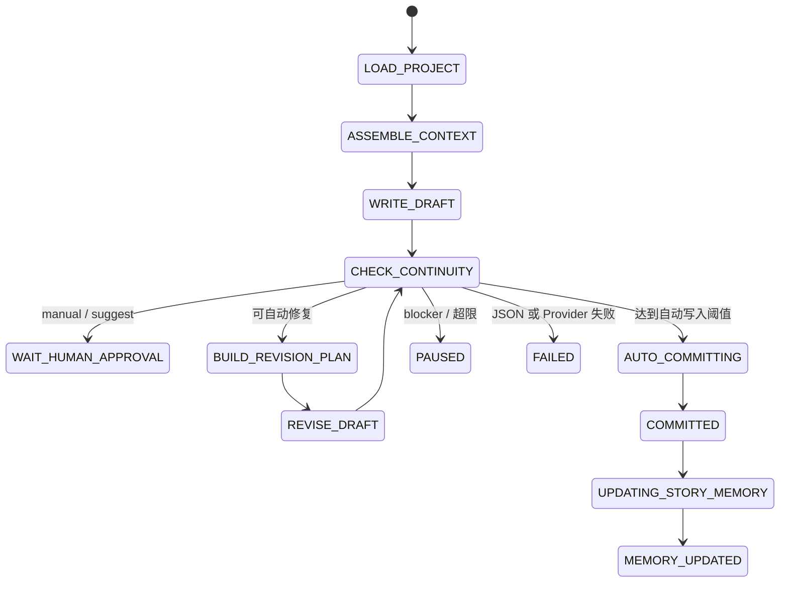

# MVP 3 自动章节生产线设计

## 1. 定义

MVP 3 由以下能力组成：

```text
Reference System
+ Reverse Story Engineering
+ Auto Review
+ Auto Revise
+ Auto Commit
+ Multi Chapter Run
+ Persistent Story Memory
```

本轮只实现 Phase 2 的单章 P0。多章运行、反向提取和完整 Story Memory UI 只设计，不实现。

## 2. 当前基线

- 现有入口 `POST /api/projects/{project_id}/chapters/{chapter_id}/run` 保持人工审批语义。
- `DraftWriterAgent`、`RevisionWriterAgent` 输出正文文本，`DraftTextGuard` 校验。
- `ContinuityCheckerAgent` 输出 JSON，经过 `JsonGuard` 和 Pydantic 校验。
- 初稿和修订均写入不可变 `ChapterVersion`。
- `approve_run()` 才会把人工批准版本写入 `Chapter.content`。
- 项目不存在独立 `StateStore`。当前状态能力分散在 `CanonState`、`Chapter.summary` 和
  `ContextBuilder` 中。

## 3. Review Mode

最终支持：

| 模式 | 自动检查 | 自动修订 | 自动写入 | 本轮 |
| --- | --- | --- | --- | --- |
| `manual_review` | 是 | 否 | 否 | 实现 |
| `ai_review_suggest` | 是 | 否 | 否 | 设计兼容 |
| `ai_auto_revise` | 是 | 是 | 否 | 实现 |
| `ai_auto_commit` | 是 | 是 | 是 | 实现 |
| `full_autonomous` | 是 | 是 | 是，多章 | Phase 3 |

`full_autonomous` 不是系统权限。它不得删除数据、修改 Provider、调用未授权外部服务或绕过日志。

## 4. 单章状态机



## 5. Run Policy

`AutoRunPolicy` 是 Run 级不可隐式提升的授权：

```json
{
  "mode": "manual_review",
  "max_revision_rounds_per_chapter": 2,
  "max_total_model_calls": 30,
  "stop_on_blocker": true,
  "stop_on_major_after_rounds": 2,
  "auto_commit_threshold": {
    "allow_minor": true,
    "allow_major": false,
    "allow_blocker": false,
    "min_plot_score": 7
  },
  "reference_pack_id": null,
  "update_story_memory": true
}
```

本轮 `min_plot_score` 仅持久化，直到 Checker 输出 plot score 后才参与判定。

## 6. 暂停与失败

- `blocker`、不可自动修复的 major、修订轮次超限进入 `PAUSED`。
- Checker JSON 解析失败、模型超时、Provider error 进入 `FAILED`，不得静默成功。
- 暂停记录 `pause_reason`、失败 step、当前版本、修订轮次和建议动作。
- `PAUSED` 会释放 chapter active slot；本轮暂不提供自动 resume。

## 7. 兼容边界

- 不改旧 generate API。
- 不删除 `WritingTask`、`GenerationRun`、`chapter_pipeline.py`。
- 不改变人工 approve/reject/revise。
- 不删除任何 `ChapterVersion`。
- Auto Commit 前必须存在通过 Guard 的当前版本及完整 RunStep/ModelCall 日志。
