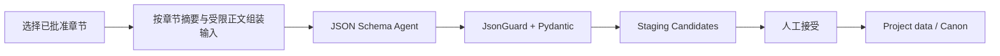

# Reverse Story Engineering 设计

## 1. 目标

从已批准正文提取故事框架、角色、世界规则、时间线、伏笔和后续章节计划草案。

## 2. 安全边界

- 只读取已批准章节或用户明确选择的版本。
- 输出先进入 staging，不直接写 Canon。
- 每条候选必须带来源章节、证据摘录、confidence 和冲突信息。
- 用户可逐条接受、批量接受或拒绝。
- 低风险自动接受是未来选项，默认关闭。

## 3. 建议模型

```text
ExtractionRun
  source_chapter_ids
  status
  extraction_options_json

ExtractionCandidate
  candidate_type
  payload_json
  evidence_json
  confidence
  status: staged / accepted / rejected / conflict
```

## 4. P0 提取流程



P0 类型：故事框架、角色卡、世界规则、后续章节计划。时间线和伏笔为 P1。

## 5. 本轮状态

本文件仅完成设计。Phase 2 不新增 extraction API、表或前端入口。
