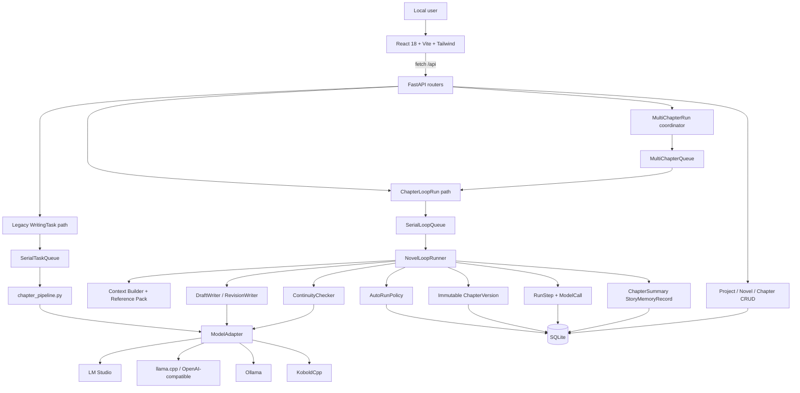
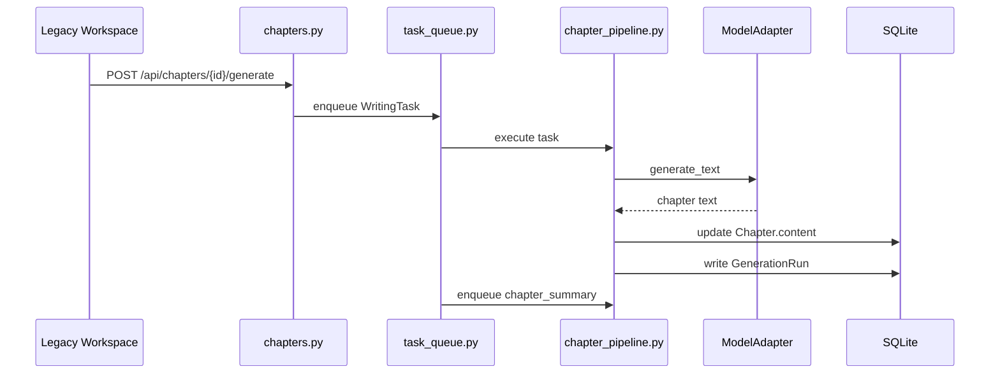
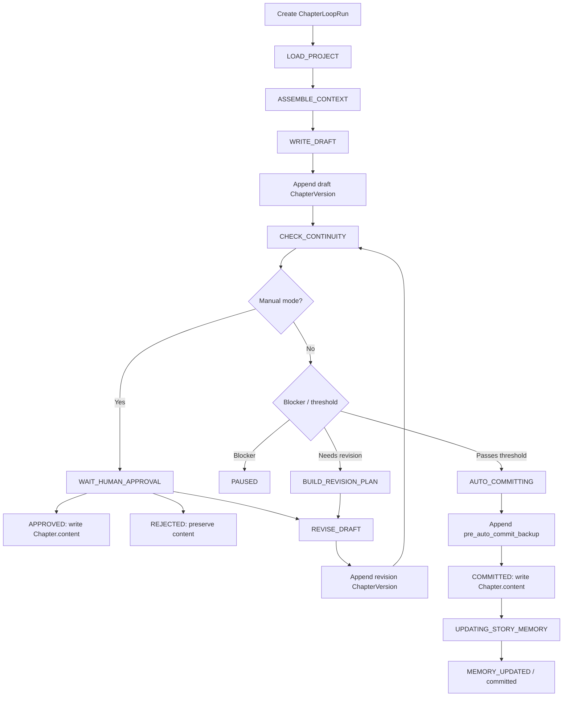
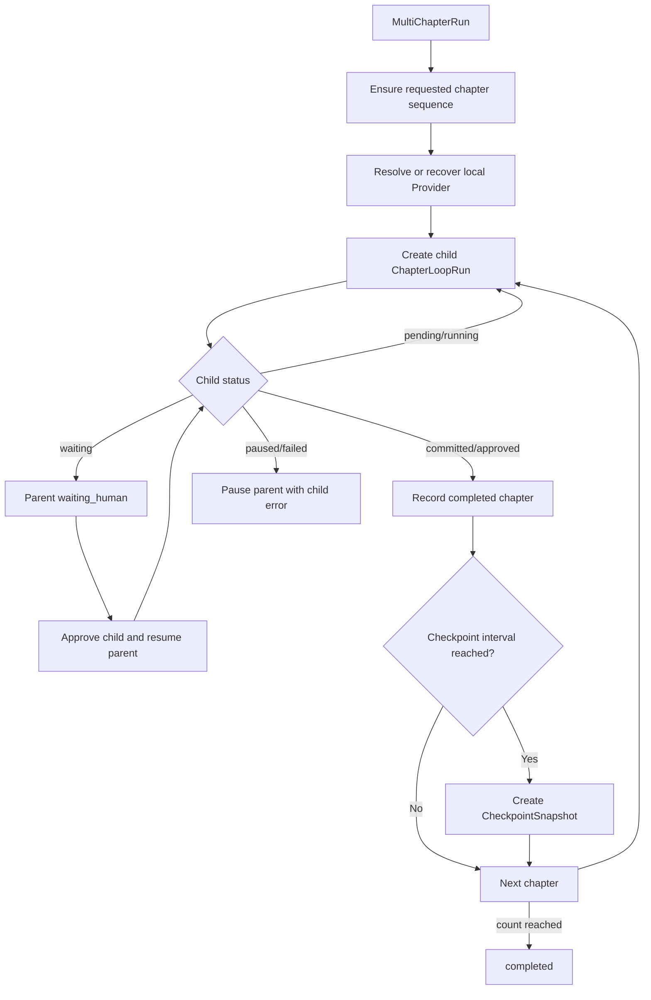

# AI Architecture Map

## System overview

## Frontend map

| Area | File | Responsibility |
|---|---|---|
| Entry and routing | `apps/web/src/App.tsx` | Loads global data and parses hash routes |
| API wrapper | `apps/web/src/services/api.ts` | Adds `/api`, parses errors |
| Global shell | `apps/web/src/components/AppShell.tsx` | Global navigation |
| Project shell | `apps/web/src/components/ProjectWorkspaceShell.tsx` | Project tabs and advanced legacy area |
| Dashboard | `apps/web/src/components/Dashboard.tsx` | Projects and active-run signals |
| Chapter workspace | `apps/web/src/features/chapters/ChapterWorkspaceV2.tsx` | Edit chapter, select mode/count/references, start runs |
| Run list | `apps/web/src/features/runs/RunListPage.tsx` | Loop run summaries and production lines |
| Run detail | `apps/web/src/features/runs/RunDetailPage.tsx` | Streaming preview, versions, report, logs, decisions |
| Timeline | `apps/web/src/features/runs/RunStateTimeline.tsx` | RunStep state history |
| Continuity | `apps/web/src/features/runs/ContinuityReportPanel.tsx` | Structured issue display |
| Multi-chapter | `apps/web/src/features/runs/MultiChapterRunsPanel.tsx` | Parent run progress and controls |
| Models | `apps/web/src/components/ModelSettings.tsx` | Providers and local inventory |
| Prompt manager | `apps/web/src/components/PromptManager.tsx` | Runtime prompt templates |

The frontend has no React Router, Redux, Zustand or component library. Routing is implemented by
`apps/web/src/App.tsx::parseRoute()` and `window.location.hash`.

## Backend map

| Layer | Directory | Responsibility |
|---|---|---|
| Application | `services/api/app/main.py` | Lifespan, route registration, queue startup |
| API | `services/api/app/routers/` | CRUD, Loop, auto and multi-chapter endpoints |
| ORM | `services/api/app/models/` | SQLAlchemy entities |
| Schema | `services/api/app/schemas/` | Pydantic request/response and agent output validation |
| Agents | `services/api/app/agents/` | Writer text agents and structured Checker |
| Workflow | `services/api/app/workflow/` | State enum, policy defaults and single-run executor |
| Services | `services/api/app/services/` | Context, logging, versions, approval, policy, memory, recovery |
| Providers | `services/api/app/providers/` | Unified model interface and HTTP adapters |
| Legacy pipeline | `services/api/app/pipelines/chapter_pipeline.py` | Old WritingTask execution |
| Prompt files | `services/api/app/prompts/` | Seeded runtime prompts |
| Migrations | `services/api/migrations/versions/` | Auditable schema changes |
| Tests | `services/api/tests/` | API, Loop, stability, auto and multi-chapter tests |

## Legacy generation flow

This path may directly update `Chapter.content`. It must remain backward compatible. The UI labels it
Legacy / Advanced in `apps/web/src/components/ProjectWorkspaceShell.tsx`.

## New single-chapter Loop flow

Implementation:

- API creation: `services/api/app/routers/loop_runs.py::create_loop_run()` and
  `services/api/app/routers/auto_runs.py::create_auto_run()`.
- Executor: `services/api/app/workflow/runner.py::NovelLoopRunner`.
- Decision policy: `services/api/app/services/auto_pipeline.py::next_state_after_check()`.
- Human decisions: `services/api/app/services/loop_approval.py`.

## Multi-chapter flow

Implementation:

- API: `services/api/app/routers/multi_chapter_runs.py`.
- Coordinator: `services/api/app/services/multi_chapter.py::MultiChapterRunner`.
- Chapter fallback: `services/api/app/services/chapter_plan_fallback.py`.
- Provider recovery: `services/api/app/services/provider_recovery.py`.

## State machine

Defined by `services/api/app/workflow/states.py::LoopState`:

| State | Meaning |
|---|---|
| `LOAD_PROJECT` | Validate ownership and Provider |
| `ASSEMBLE_CONTEXT` | Build bounded generation context |
| `WRITE_DRAFT` | Generate initial text |
| `BUILD_REVISION_PLAN` | Convert Checker issues to deterministic fixes |
| `REVISE_DRAFT` | Generate full revised text |
| `CHECK_CONTINUITY` | Run structured Checker |
| `WAIT_HUMAN_APPROVAL` | Wait for approve/reject/revise |
| `AUTO_COMMITTING` | Validate automatic write conditions |
| `COMMITTED` | Official content has been written |
| `UPDATING_STORY_MEMORY` | Build minimal summary memory |
| `MEMORY_UPDATED` | Auto run completed |
| `PAUSED` | Recoverable policy or provider stop |
| `APPROVED` | Human-approved terminal state |
| `REJECTED` | Human-rejected terminal state |
| `STOPPED` | User-stopped terminal state |
| `FAILED` | Unrecoverable execution failure |

The `TRANSITIONS` mapping handles static transitions. Checker-dependent transitions are selected by
`NovelLoopRunner._next_state()`.

## Data model

### Core content

`services/api/app/models/entities.py` contains Project, Novel, Chapter, ChapterOutline, Character,
WorldRule, CanonState, ModelProvider, WritingTask, GenerationRun and related legacy entities.

### Loop audit and versions

`services/api/app/models/loop_entities.py`:

- `ChapterLoopRun`: current state, context, report, streaming preview and decision fields.
- `RunStep`: ordered state execution log.
- `ModelCall`: prompt, response, options, raw payload, tokens, timing and errors.
- `ChapterVersion`: append-only chapter text with parent and SHA-256 hash.

`ChapterVersion` has an ORM `before_update` listener that raises on UPDATE. It does not prevent direct
out-of-band SQL changes, so database file access remains trusted.

### Automatic and multi-chapter entities

`services/api/app/models/auto_entities.py`:

- `ReferencePack`
- `AutoRunPolicy`
- `RevisionPlan`
- `StoryMemoryRecord`
- `MultiChapterRun`
- `CheckpointSnapshot`

## Prompt mechanism

Loop prompts:

- `services/api/app/prompts/novel_loop/draft_writer.md`
- `services/api/app/prompts/novel_loop/revision_writer.md`
- `services/api/app/prompts/novel_loop/continuity_checker.md`

`services/api/app/agents/base.py` loads these files. Writer prompts produce text. Checker prompts
produce JSON validated as `ContinuityCheckerOutput`.

Legacy prompts under `services/api/app/prompts/*.md` are seeded into PromptTemplate records by
`services/api/app/services/prompt_store.py` at startup. Do not assume editing a file changes an
existing database template unless the seeding/update behavior is checked.

## Provider Adapter mechanism

The interface is `services/api/app/providers/base.py::ModelAdapter`.

Concrete adapters are selected by `services/api/app/providers/adapters.py::get_adapter()`:

- LM Studio
- Ollama
- KoboldCpp
- llama.cpp / text-generation-webui / generic OpenAI-compatible

Writer agents use streaming when supported. Unsupported providers fall back to final text. Provider
availability and local process recovery are separate concerns handled by
`services/api/app/services/provider_recovery.py`.

## RunLogger mechanism

`services/api/app/services/run_logger.py::RunLogger` persists:

### RunStep

- run ID and sequence
- state and status
- input/output JSON
- error code and message
- start and finish times

### ModelCall

- run ID and step ID
- provider ID and agent name
- complete prompt and response
- parsed result and raw provider response
- options
- token counts and duration
- status, error code and error

This is a privacy risk because prompts and responses may contain private manuscript text.

## JsonGuard mechanism

`services/api/app/services/json_guard.py::JsonGuard.parse_and_validate()`:

1. Removes a Markdown JSON fence.
2. Extracts the first JSON object.
3. Runs `json.loads`.
4. Runs Pydantic `model_validate`.

Errors:

- `EMPTY_MODEL_OUTPUT`
- `JSON_PARSE_ERROR`
- `SCHEMA_VALIDATION_ERROR`

Structured agents may perform one model-based JSON repair in `services/api/app/agents/base.py`.
Writer text is not passed through JsonGuard; it uses DraftTextGuard.

## ChapterVersion mechanism

`services/api/app/services/version_manager.py::ChapterVersionManager` assigns the next chapter-local
version number and creates a content hash.

Kinds currently include:

- `draft`
- `revision`
- `pre_auto_commit_backup`
- `pre_restore_backup`

Manual approve writes the selected version through
`services/api/app/services/loop_approval.py::approve_run()`.
Auto commit writes through `services/api/app/services/auto_pipeline.py::commit_version()`.
Restore writes through `services/api/app/routers/loop_runs.py::restore_chapter_version()`.

## Human gate

Human approval is implemented:

- `POST /api/projects/{project_id}/runs/{run_id}/approve`
- `POST /api/projects/{project_id}/runs/{run_id}/reject`
- `POST /api/projects/{project_id}/runs/{run_id}/revise`

The UI is `apps/web/src/features/runs/RunDecisionBar.tsx`.

Manual mode cannot write official content before approve. AI Auto Revise returns to the human gate.
AI Auto Commit and Full Autonomous may write automatically only after policy validation.

## Module touch table

| Module | File | Responsibility | Can modify? | Risk |
|---|---|---|---|---|
| Legacy API | `services/api/app/routers/chapters.py` | Old generation endpoints | Avoid | Critical compatibility |
| Legacy pipeline | `services/api/app/pipelines/chapter_pipeline.py` | Direct chapter tasks | Avoid | Direct content writes |
| Loop routes | `services/api/app/routers/loop_runs.py` | Loop lifecycle and decisions | Carefully | API and content safety |
| State machine | `services/api/app/workflow/runner.py` | Execute Loop states | Carefully | Highest workflow risk |
| Auto policy | `services/api/app/services/auto_pipeline.py` | Revise/commit thresholds | Carefully | Auto-write risk |
| Multi coordinator | `services/api/app/services/multi_chapter.py` | Sequential child runs | Carefully | Queue/resume risk |
| Version model | `services/api/app/models/loop_entities.py` | Audit and immutability | Rarely | Migration/data risk |
| Structured guard | `services/api/app/services/json_guard.py` | Parse and validate JSON | Carefully | Silent-success risk |
| Run logger | `services/api/app/services/run_logger.py` | Persist audit trail | Additive only | Privacy/audit risk |
| Provider adapters | `services/api/app/providers/adapters.py` | Model HTTP protocols | Carefully | Provider regressions |
| Frontend | `apps/web/src/` | User workflow | Yes, scoped | Can hide safety state |
| Docs | `docs/` | Architecture and reports | Yes | Keep current facts |
