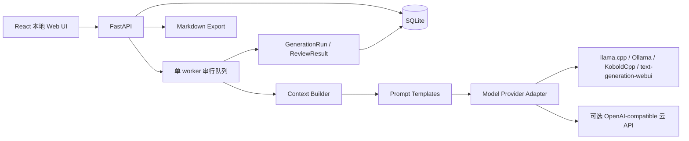

# 架构

## 模块职责

- Project Manager：项目和小说生命周期。
- Novel Workspace：章节树、编辑器、角色、世界设定和运行记录。
- Outline Manager：章节目标、章节大纲和可选场景大纲。
- Context Builder：按预算选择并裁剪结构化事实。
- Model Provider Adapter：统一 `generate_text(prompt, options)`。
- Chapter Pipeline：构建 prompt、调用模型、保存结果并更新章节状态。
- Review Pipeline：保存建议，不改正文。
- State Manager：保存 canon、冲突、伏笔、事件和待确认人物状态。
- Export Manager：按章节顺序导出 Markdown。

## 任务模型

所有模型调用先创建 `WritingTask`，再由单 worker 顺序执行。等待中的任务可暂停；失败任务可
重试。运行中的 HTTP 请求在 MVP 中不能强制中断，暂停请求会阻止结果写回并把任务标记为
paused。每次调用无论成功失败都创建 `GenerationRun`。

## 上下文预算

默认预算按用户要求分配：总纲 10%、章节目标 15%、章节/场景大纲 15%、角色 15%、
近三章摘要 20%、世界规则 10%、冲突和伏笔 10%、风格与格式 5%。

裁剪顺序：

1. 必保留当前目标、章节大纲、相关角色状态和上一章摘要。
2. 其次保留近三章摘要、关键世界规则、冲突和伏笔。
3. 最后保留长总纲、较早摘要、风格说明和示例。

MVP 使用保守字符估算，不绑定具体 tokenizer。GenerationRun 会保存最终 prompt，便于针对
实际模型调校预算。
